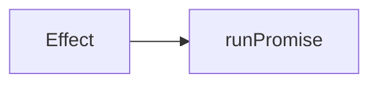

# Writing chapters

Run `bun run check:content` before committing. It renders every chapter and
fails on anything listed here that can be checked automatically.

## Prose rules

These two are not style preferences. They are requirements.

### 1. No em dash

Use a comma, a full stop, or parentheses.

```
Bad:  Effect is lazy — nothing runs until you ask it to.
Good: Effect is lazy. Nothing runs until you ask it to.
Good: Effect is lazy, so nothing runs until you ask it to.
```

`check:content` fails on any em dash in a chapter file.

### 2. No unexplained jargon

Write for someone who has never used Effect. If a term is unavoidable, define
it in one plain sentence the first time it appears, then use it consistently.

```
Bad:  Effect.gen lets you write monadic code in direct style, and the
      yield* operator performs the bind.
Good: Effect.gen lets you write steps one after another, like normal code.
      The yield* keyword means "run this effect and give me its result".
```

Words that need a definition before first use: effect, channel, combinator,
service, layer, fiber, defect, schedule. Words to avoid entirely unless the
chapter is about them: monad, bind, functor, higher kinded, variance,
referential transparency.

## Frontmatter

Every file in `content/` needs all four fields.

```yaml
---
title: Errors
order: 5
slug: 05-errors
summary: One sentence, shown in the sidebar and on the home page.
---
```

`order` sets the reading order and must be unique. `slug` is the URL and must
match the filename without the extension.

## Code blocks

Two kinds, and the difference matters.

**Tagged with `twoslash`.** Compiled at build time against `effect@rc` with
`strict` on. If it does not typecheck, the build fails. Readers get hover
types. Use this for anything you are claiming is correct.

````
```ts twoslash
import { Effect } from 'effect'

const program = Effect.succeed(1)
//    ^?
```
````

`//    ^?` reveals the inferred type on the line above, as a block under that
line. Use it whenever the point of the snippet is what Effect inferred,
especially for the error and requirement channels. It is the strongest
teaching tool in this setup, so reach for it often.

Hover tooltips are turned off on purpose. Twoslash adds one to every
identifier by default, but the popup is absolutely positioned and gets clipped
by the code block it sits in, and a type worth teaching should be pinned on
the page rather than hidden behind a hover. If a type matters, mark it with
`^?`.

The `^?` must sit on the line directly below the one where the name appears,
with the caret under the name's first letter. That means the declaration has
to fit on one line. This fails, because the line above the marker is `})`:

```
const log = Effect.sync(() => {
  console.log('done')
})
//    ^?
```

Write it as `const log = Effect.sync(() => console.log('done'))` instead. Also
note that `declare` lines are stripped before the query runs, so you cannot
point `^?` at one.

When the declaration genuinely cannot fit on one line, such as a multi-line
`pipe` or an options object, do not force it. Write the type as an annotation
instead:

```
const piped: Effect.Effect<number, 'NotFound' | 'BadFormat'> = readFile(
  'port.txt',
).pipe(Effect.flatMap(parse))
```

The reader still sees the type, and because the block is compiled, a wrong
annotation fails the build. That is a stronger guarantee than a reveal.

`// ---cut---` hides everything above it from the reader while still
compiling it. Use it to skip imports and setup that were already shown.

When a snippet does fail to compile, `bun run check:content` prints which file
and which numbered twoslash block broke, followed by the compiler error. Line
numbers in the error count from the start of that block, after the cut.

Snippets compile with `strict` on, DOM types available, and `vite/client`
loaded, so `fetch` and `import.meta.env` are both real. Nothing else from the
app is in scope: import from `effect` and declare the rest.

**Untagged.** Highlighted only, never compiled. Use for fragments, for
deliberately wrong code you are about to fix, and for anything that cannot
stand alone as a file.

Reach for `twoslash` by default. Only drop to untagged when the snippet
genuinely cannot compile on its own.

## Diagrams

Fenced as `mermaid`. Always quote your labels, and write literal `<` and `>`
inside them.

```
Good: A["Effect<A, E, R>"]
Bad:  A[Effect<A, E, R>]
Bad:  A["Effect&lt;A, E, R&gt;"]
```

Two separate things bite here and the build handles both for you, as long as
the label is quoted.

First, writing `&lt;` by hand gets the ampersand escaped again, and the reader
sees the raw entity on screen. `check:content` fails on this.

Second, mermaid strips anything that looks like an HTML tag from a label, so
an unquoted `Effect<A, E, R>` renders as just `Effect`. The plugin rewrites
`<` and `>` to mermaid's numeric entities, but only inside quoted labels,
because the `>` in an arrow like `-->` has to survive. An unquoted label skips
that rewrite and loses its brackets.

````

````

One consequence of that rewrite: `<br/>` inside a label renders as the literal
text `<br/>`, because the escaping happens before mermaid sees it. Keep labels
to one line, or split them across two nodes.

Mermaid is around half a megabyte and loads only on chapters that contain a
diagram, so do not add one out of habit. Add one when a picture explains
something that a paragraph does not.

## Shape of a chapter

Roughly 600 to 1200 words. Long enough to teach one idea properly, short
enough to finish in a sitting.

1. What problem this chapter solves, in two or three sentences.
2. The idea, built up in small steps with a runnable snippet at each step.
3. The part people get wrong, stated plainly.
4. One or two sentences pointing at the next chapter.

Do not open with a definition. Open with the problem, then earn the
definition.

Every chapter must leave the reader able to run something. If a chapter has no
snippet they can paste into a file and execute, it is not finished.

## Adding a chapter

Drop a `.md` file into `content/`. That is the whole process. The sidebar,
home page, previous and next links, and routing all come from the file.
