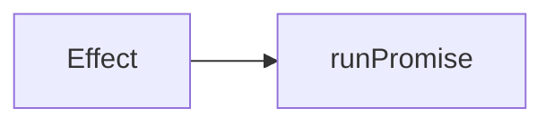

# Writing chapters

Run `bun run check:content` before committing. It reads the markdown and
fails on the rules below that a machine can check. It does not compile
anything: `bun run build` does that, and a `twoslash` snippet that does not
typecheck fails there.

Rules marked **checked** fail the run. The rest are judgement calls, and the
only thing enforcing them is review.

## Prose rules

Neither is a style preference. Only the first can be checked.

### 1. No em dash (checked)

Use a comma, a full stop, or parentheses.

```
Bad:  Effect is lazy — nothing runs until you ask it to.
Good: Effect is lazy. Nothing runs until you ask it to.
Good: Effect is lazy, so nothing runs until you ask it to.
```

`check:content` fails on any em dash in a chapter file, draft or not.

### 2. No unexplained jargon (judgement call)

Write for someone who has never used Effect. If a term is unavoidable, define
it in one plain sentence the first time it appears, then use it consistently.

```
Bad:  Effect.gen lets you write monadic code in direct style, and the
      yield* operator performs the bind.
Good: Effect.gen lets you write steps one after another, like normal code.
      The yield* keyword means "run this effect and give me its result".
```

Words that need a definition before first use: effect, channel, combinator,
service, layer, fiber, defect, schedule. Words to avoid entirely unless the
chapter is about them: monad, bind, functor, higher kinded, variance,
referential transparency.

## How content is organised

`content/` holds one folder per track, and every folder holds an `index.md`
describing it plus one `.md` per chapter. A loose `.md` at the top of
`content/` is an error.

Tracks are grouped into themes, and `content/themes.json` is the list of them.
It decides both which themes the home page shows and what order they appear
in:

```json
[
  { "slug": "foundations", "title": "Foundations" },
  { "slug": "applications", "title": "Building applications" }
]
```

A track naming a theme that is not in this list fails `check:content`, because
the home page renders by theme and the track would otherwise be reachable only
by typing its URL.

## Frontmatter

A chapter needs three fields, plus an optional `slug`.

```yaml
---
title: Errors
order: 5
slug: 05-errors
summary: One sentence, shown under the title and indexed for search.
---
```

`order` sequences the chapter within its track, and two tracks may both open
with an `order: 1`. `slug` is optional, and when present must match the
filename without the extension. Add `draft: true` for an outline with no prose
yet. It is badged in the sidebar, exempt from the runnable-snippet rule, and
left out of the search index, since a hit on an outline sends a reader
somewhere that cannot answer what they asked. Every other rule here still
applies to it.

An `index.md` needs seven, and takes its slug from the folder name.

```yaml
---
title: Basic Effect
order: 2
theme: foundations
level: beginner
icon: BookOpen
prereq: Some TypeScript, no Effect
summary: One sentence, shown on the track's card on the home page.
---
```

`order` sequences the track within its theme, so two themes may each hold an
`order: 1`. `level` is `beginner` or `intermediate`, shown as a badge on the
track's card. `icon` is a lucide icon name, and it has to be in the map in
`src/migration/src/components/track-icon.tsx`, which is explicit so the
bundle does not pull in the whole icon set. `prereq` is one line on what the
track assumes, and it shows on the card too.

There is no reading time field. Minutes are counted from the page itself,
prose at 200 words a minute and code by the line. Each chapter shows its own
figure in the sidebar, and a track's card on the home page shows the sum of
its chapters plus its own page.

## Code blocks

Two kinds, and the difference matters.

**Tagged with `twoslash`.** Compiled by `bun run build` against `effect@rc`
with `strict` on. If it does not typecheck, the build fails. Use this for
anything you are claiming is correct.

````
```ts twoslash
import { Effect } from 'effect'

const program = Effect.succeed(1)
//    ^?
```
````

`//    ^?` reveals the inferred type on the line above, as a block under that
line. Use it whenever the point of the snippet is what Effect inferred,
especially for the error and requirement channels. It is the strongest
teaching tool in this setup, so reach for it often.

Hover tooltips are turned off on purpose. Twoslash adds one to every
identifier by default, but the popup is absolutely positioned and gets clipped
by the code block it sits in, and a type worth teaching should be pinned on
the page rather than hidden behind a hover. If a type matters, mark it with
`^?`.

The `^?` must sit on the line directly below the one where the name appears,
with the caret under the name's first letter. That means the declaration has
to fit on one line. This fails, because the line above the marker is `})`:

```
const log = Effect.sync(() => {
  console.log('done')
})
//    ^?
```

Write it as `const log = Effect.sync(() => console.log('done'))` instead. Also
note that `declare` lines are stripped before the query runs, so you cannot
point `^?` at one.

When the declaration genuinely cannot fit on one line, such as a multi-line
`pipe` or an options object, do not force it. Write the type as an annotation
instead:

```
const piped: Effect.Effect<number, 'NotFound' | 'BadFormat'> = readFile(
  'port.txt',
).pipe(Effect.flatMap(parse))
```

The reader still sees the type, and because the block is compiled, a wrong
annotation fails the build. That is a stronger guarantee than a reveal.

`// ---cut---` hides everything above it from the reader while still
compiling it. Use it to skip imports and setup that were already shown.

When a snippet does fail to compile, `bun run build` names the file and the
error. Line numbers count from the start of that block, after the cut.

Snippets compile with `strict` on, DOM types available, and `vite/client`
loaded, so `fetch` and `import.meta.env` are both real. Nothing else from the
app is in scope: import from `effect` and declare the rest.

**Untagged.** Highlighted only, never compiled. Use for fragments, for
deliberately wrong code you are about to fix, and for anything that cannot
stand alone as a file.

Reach for `twoslash` by default. Only drop to untagged when the snippet
genuinely cannot compile on its own.

## Diagrams

Fenced as `mermaid`. Always quote your labels, and write literal `<` and `>`
inside them.

```
Good: A["Effect<A, E, R>"]
Bad:  A[Effect<A, E, R>]
Bad:  A["Effect&lt;A, E, R&gt;"]
```

Two separate things bite here and the build handles both for you, as long as
the label is quoted. Neither is checked: read the diagram once in the browser.

First, writing `&lt;` by hand gets the ampersand escaped again, and the reader
sees the raw entity on screen.

Second, mermaid strips anything that looks like an HTML tag from a label, so
an unquoted `Effect<A, E, R>` renders as just `Effect`. A remark plugin in
`src/migration/source.config.ts` rewrites `<` and `>` to mermaid's numeric
entities, but only inside quoted labels,
because the `>` in an arrow like `-->` has to survive. An unquoted label skips
that rewrite and loses its brackets.

````

````

One consequence of that rewrite: `<br/>` inside a label renders as the literal
text `<br/>`, because the escaping happens before mermaid sees it. Keep labels
to one line, or split them across two nodes.

Mermaid is around half a megabyte and loads only on chapters that contain a
diagram, so do not add one out of habit. Add one when a picture explains
something that a paragraph does not.

## Shape of a chapter

Judgement calls, all of it, except the last paragraph.

Roughly 600 to 1200 words. Long enough to teach one idea properly, short
enough to finish in a sitting.

1. What problem this chapter solves, in two or three sentences.
2. The idea, built up in small steps with a runnable snippet at each step.
3. The part people get wrong, stated plainly.
4. One or two sentences pointing at the next chapter, or at the next track
   if this is the last one.

Do not open with a definition. Open with the problem, then earn the
definition.

Every chapter must leave the reader able to run something (**checked**). A
chapter with no `ts twoslash` fence fails `check:content` unless it is marked
`draft: true`.

## Linking between chapters

Write an ordinary markdown link to the path,
`[Errors](/learn/basic-effect/05-errors)`, or `[Basic Effect](/learn/basic-effect)`
for a track. This is **checked**:
`check:content` matches every one of these against the urls the site serves,
built from the filenames the same way Fumadocs routes them, so a renamed
chapter fails the run rather than leaving a dead link somewhere else.

Do not refer to a chapter by its number in prose (judgement call). Chapters
get renumbered and moved between tracks, and a link survives that while
"chapter eleven" does not.

## Adding a chapter

Drop a `.md` file into the track's folder. That is the whole process. The
sidebar, previous and next links, reading time and routing all come from the
file. Ordering is the `01-` prefix on the filename, so there is no `meta.json`
to edit and nothing to register.

## Adding a track

Make a folder under `content/` and put an `index.md` in it. The folder name is
the URL. Pick a `theme` from `themes.json` and an `order` among the tracks
already in that theme.

## Adding a theme

Add a `{ slug, title }` to `content/themes.json`. Position in the array is the
order the section appears on the home page. A theme with no tracks yet is left
out of the page rather than rendered as an empty heading, so it is fine to add
the theme first.
