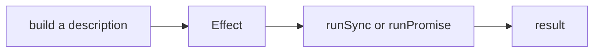

Here is a function that fetches a user. It is ordinary TypeScript and there is
nothing wrong with it.

```ts twoslash
type User = { id: number; name: string }

async function getUser(id: number): Promise<User> {
  const response = await fetch(`https://example.com/users/${id}`)
  if (!response.ok) {
    throw new Error(`Request failed with status ${response.status}`)
  }
  return (await response.json()) as User
}
```

Now answer two questions about it without reading the body.

How can this fail? The type says `Promise<User>`, so as far as the compiler is
concerned, it cannot. In reality it can fail in at least three ways: the
network can drop, the server can answer with a 500, and the body might not be
the shape we claimed. None of that is in the type.

What does it need in order to run? It needs `fetch`, and it has a URL baked
into it. Neither fact appears in the signature either. To test this function
you have to reach outside it and replace a global.

Both problems have the same root. The function does its work the moment you
call it, so the only place its details can live is inside the body.

## A description instead

Effect starts from a different place. Building an Effect does not run
anything. It builds a value that describes what should happen.

```ts twoslash
import { Effect } from 'effect'

const program = Effect.sync(() => {
  console.log('hello')
})
```

Nothing has been printed. `program` is a value sitting in a variable, in the
same way that a recipe is not a meal. You can pass it around, store it in an
array, or hand it to a function, and still nothing happens.

To actually run it, you hand it to a run function.

```ts twoslash
import { Effect } from 'effect'
const program = Effect.sync(() => {
  console.log('hello')
})
// ---cut---
Effect.runSync(program)
```

That prints `hello`. There is a clear line between building the description
and running it, and everything else in Effect follows from that line existing.



## What the description carries

Because the program is a value rather than a call in progress, the type can
describe it properly. Effect's type has three parts.

```ts twoslash
import { Effect } from 'effect'

const program = Effect.succeed(42)
//    ^?
```

Read that as: when run, it produces a `number`, it fails in `never` ways, and
it needs `never` from the outside. `never` here means "there is nothing of
this kind". The program cannot fail and needs nothing.

Now one that can fail.

```ts twoslash
import { Effect } from 'effect'

const risky = Effect.fail('the server said no')
//    ^?
```

It produces nothing, and it fails with a `string`. The failure is in the type,
which is the whole point. Chapter two goes through all three parts properly.

## Running it

Two run functions cover almost everything. `Effect.runSync` is for programs
with no asynchronous work in them, and it returns the value directly.
`Effect.runPromise` works for anything and returns a Promise.

```ts twoslash
import { Effect } from 'effect'

const program = Effect.succeed(42)

const value = Effect.runSync(program)
//    ^?
```

```ts twoslash
import { Effect } from 'effect'
const program = Effect.succeed(42)
// ---cut---
const value = await Effect.runPromise(program)
//    ^?
```

Run functions belong at the edge of your program, usually in one place near
the entry point. Everywhere else you build descriptions and combine them. If
you find yourself running an Effect in the middle of your code so you can use
its result, that is a sign to look at chapter four instead.

## The trade

You now write a little more to say what you mean. In exchange the compiler
knows how your code can fail and what it depends on, and it will not let you
forget either one.

That is worth saying plainly, because the first few chapters will feel like
extra work for no gain. The gain arrives in chapter five, when the compiler
starts refusing to let unhandled failures through.

## Next

Chapter two reads the three parts of `Effect<A, E, R>` off real signatures, so
you can look at an unfamiliar Effect and say what it does before running it.
