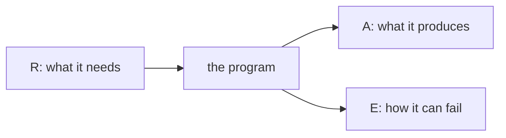

Every Effect has the same shape.

```
Effect<A, E, R>
```

Three slots, always in that order. Once you can read them, an unfamiliar
signature tells you what a program produces, how it can fail, and what it
needs, without opening the body.



## A is what you get

`A` is the value you receive when the program finishes successfully.

```ts twoslash
import { Effect } from 'effect'

const count = Effect.succeed(42)
//    ^?

const greeting = Effect.succeed('hello')
//    ^?
```

This is the part that behaves like a return type, so it is the easiest of the
three. If an Effect produces nothing useful, `A` is `void`.

```ts twoslash
import { Effect } from 'effect'

const log = Effect.sync(() => console.log('done'))
//    ^?
```

## E is how it fails

`E` is the type of an expected failure. Not a crash or a bug, but a thing you
knew could happen and want the caller to deal with.

```ts twoslash
import { Effect } from 'effect'

const rejected = Effect.fail('the server said no')
//    ^?
```

`A` is `never` there, because a program that always fails never produces a
value. That is `never` doing its job: it means this slot has no possible
value.

The same word appears in the `E` slot when a program cannot fail.

```ts twoslash
import { Effect } from 'effect'

const safe = Effect.succeed(1)
//    ^?
```

`never` in `E` is a promise the compiler will hold you to. Nothing can go
wrong here in a way you are expected to handle.

Failures accumulate as a union when you combine programs, which is what makes
this useful. Two different failures stay two different failures.

```ts twoslash
import { Effect } from 'effect'

declare const readConfig: Effect.Effect<string, 'ConfigMissing'>
declare const parsePort: (raw: string) => Effect.Effect<number, 'NotANumber'>

const port = Effect.flatMap(readConfig, parsePort)
//    ^?
```

The result can fail in either way, and the type says so. Nobody wrote that
union by hand. This is the single biggest practical difference from
`Promise`, where both failures would have been flattened into nothing.

## R is what it needs

`R` lists the things that must be supplied before the program can run. People
call these requirements, or dependencies, or services. They are all the same
idea: something from outside that the program uses but does not create.

Look at a program that needs a service and one that does not.

```ts twoslash
import { Context, Effect } from 'effect'

class Clock extends Context.Service<Clock, {
  now(): Effect.Effect<number>
}>()('app/Clock') {}

const needsNothing = Effect.succeed(1)
//    ^?

const needsClock = Clock.use((clock) => clock.now())
//    ^?
```

Do not worry about how `Clock` was defined. The point is the second signature.
It says out loud that this program cannot run until somebody provides a
`Clock`, and the compiler will not let you run it until they do.

`R` is `never` when a program is ready to run on its own. Getting `R` back to
`never` is called providing the dependency, and chapter eight is about how.

For now, one rule is enough: you never build an `R` by hand. You write code
that uses services, the requirements pile up in the type on their own, and you
satisfy them in one place at the edge.

## Reading a signature cold

Put it together on something you have not seen before.

```ts twoslash
import { Effect } from 'effect'

declare const example: Effect.Effect<
  Array<string>,
  'NetworkError' | 'BadJson',
  never
>
```

Read left to right. It produces an array of strings. It can fail in two named
ways, and those are the only two you need to handle. It needs nothing, so you
can run it right now.

That is the habit worth building. Before you read what an Effect does, read
what its type already told you.

## Why the order matters

Notice that only `A` behaves like a normal return type. `E` and `R` are the
two things ordinary TypeScript throws away, and they are exactly the two
things that hurt when they go missing. A function that might fail in three
ways and needs a database connection looks identical to one that cannot fail
and needs nothing, right up until it runs in production.

Effect's answer is not clever. It just refuses to throw that information away.

## Next

Chapter three starts building real programs: turning values, throwing code and
Promises into Effects, and combining them with `map`, `flatMap` and `pipe`.
