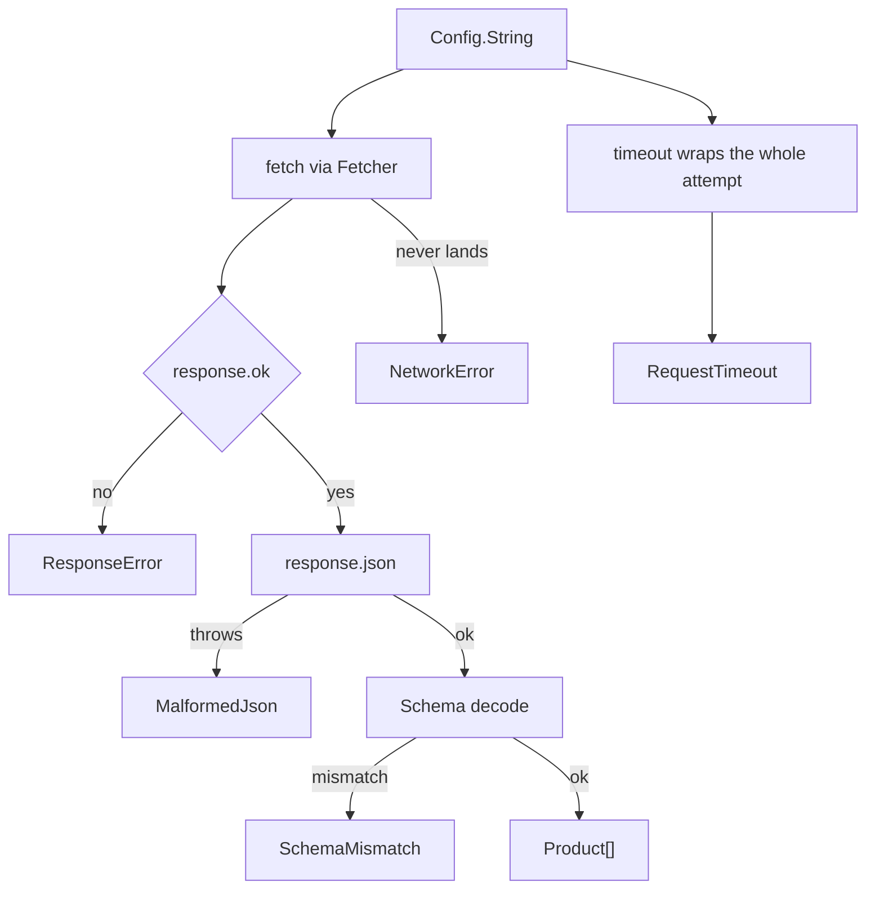

Everything so far has been one idea at a time. This chapter is all of them at
once, in code that runs in this app right now.

The [live demo](/demo) page calls the service described below. It has toggles
that break the call on purpose, so every branch here is something you can watch
fire rather than take my word for.

Here is the shape of one call.



## The value that comes from outside

```ts twoslash
import { Config } from 'effect'
// ---cut---
const baseUrl = Config.String('VITE_API_BASE_URL')
```

It is read once, when the layer is built, not on every call. A missing value
fails the build of the service rather than the first click, which is the
difference between a broken deploy you notice immediately and one you notice
when a user does.

The value lives in `.env` and reaches the browser through a `ConfigProvider`
built over `import.meta.env`. It is a public address, and chapter eight is
where that distinction is spelled out.

## What a product is

```ts twoslash
import { Schema } from 'effect'
// ---cut---
export const Product = Schema.Struct({
  id: Schema.Number,
  title: Schema.String,
  price: Schema.Number,
  category: Schema.String,
  image: Schema.String,
  rating: Schema.Struct({
    rate: Schema.Number,
    count: Schema.Number,
  }),
})

export type Product = typeof Product.Type
```

One definition. The runtime check and the type both come from it, so the page
that renders `product.rating.rate` cannot drift from what the decoder accepts.

## Every failure has a name

This is the part worth copying into your own work. Five things can go wrong,
and each one is its own type.

```ts twoslash
import { Schema } from 'effect'
// ---cut---
class NetworkError extends Schema.TaggedError<NetworkError>()('NetworkError', {
  detail: Schema.String,
}) {}

class ResponseError extends Schema.TaggedError<ResponseError>()(
  'ResponseError',
  { status: Schema.Number },
) {}

class MalformedJson extends Schema.TaggedError<MalformedJson>()(
  'MalformedJson',
  { detail: Schema.String },
) {}

class SchemaMismatch extends Schema.TaggedError<SchemaMismatch>()(
  'SchemaMismatch',
  { detail: Schema.String },
) {}

class RequestTimeout extends Schema.TaggedError<RequestTimeout>()(
  'RequestTimeout',
  { after: Schema.String },
) {}
```

The fields are chosen by what a handler would need. `ResponseError` carries the
status, because the retry decision below depends on it. `SchemaMismatch`
carries the message, because it is the only clue about what the API changed.

A single `ApiError` with a `message` field would have been less typing and
would have made the next section impossible.

## The one impure thing, behind a service

```ts twoslash
import { Context, Effect, Layer, Schema } from 'effect'
class NetworkError extends Schema.TaggedError<NetworkError>()('NetworkError', {
  detail: Schema.String,
}) {}
// ---cut---
const liveRequest = (url: string): Effect.Effect<Response, NetworkError> =>
  Effect.tryPromise({
    try: () => fetch(url),
    catch: (cause) => new NetworkError({ detail: String(cause) }),
  })

class Fetcher extends Context.Service<Fetcher, {
  request(url: string): Effect.Effect<Response, NetworkError>
}>()('learning/Fetcher') {
  static readonly layer = Layer.succeed(Fetcher)(
    Fetcher.of({ request: liveRequest }),
  )
}
```

`fetch` is the only thing in the whole service that touches the outside world,
so it is the only thing behind a seam. The demo page provides a different
`Fetcher` that returns a 500, or hands back HTML, or waits too long. The
service below never learns that anything is unusual, and that is chapter seven
paying off.

## The retry decision

Retrying is not a setting you turn on. It is a claim that trying again might
work, and that claim is false for most failures.

```ts twoslash
import { Schema } from 'effect'
class NetworkError extends Schema.TaggedError<NetworkError>()('NetworkError', { detail: Schema.String }) {}
class ResponseError extends Schema.TaggedError<ResponseError>()('ResponseError', { status: Schema.Number }) {}
class MalformedJson extends Schema.TaggedError<MalformedJson>()('MalformedJson', { detail: Schema.String }) {}
class SchemaMismatch extends Schema.TaggedError<SchemaMismatch>()('SchemaMismatch', { detail: Schema.String }) {}
class RequestTimeout extends Schema.TaggedError<RequestTimeout>()('RequestTimeout', { after: Schema.String }) {}
type ProductsError =
  | NetworkError
  | ResponseError
  | MalformedJson
  | SchemaMismatch
  | RequestTimeout
// ---cut---
const isRetryable = (error: ProductsError): boolean => {
  switch (error._tag) {
    case 'ResponseError':
      return error.status >= 500
    case 'NetworkError':
    case 'RequestTimeout':
      return true
    case 'MalformedJson':
    case 'SchemaMismatch':
      return false
  }
}
```

Read it out loud. A 500 means the server had a bad moment, so ask again. A 404
means the question was wrong, and asking the same wrong question three more
times only makes the user wait longer for the same answer. A response that does
not match the schema will not match it on the next attempt either.

This function is the reason the errors are separate types. With one `ApiError`
you would be matching on strings inside a message here, and getting it wrong.

Notice too that the switch has no `default`. If someone adds a sixth failure
later, this stops compiling until they decide whether it is worth retrying.
That is the compiler asking the right question at the right time.

```ts twoslash
import { Schedule } from 'effect'
// ---cut---
const retryPolicy = Schedule.exponential('200 millis').pipe(
  Schedule.jittered,
  Schedule.upTo({ times: 3 }),
)
```

Exponential means the gaps grow, so a struggling server is not hammered.
Jittered means the gaps are randomised a little, because a thousand clients
that all back off by exactly 200 milliseconds arrive together and repeat the
outage. Three attempts is a cap, since retrying forever is how a small problem
becomes a big one.

On the demo page the attempt log shows these gaps. With the HTTP 500 toggle
they come out around 200ms, 350ms, and 900ms, different every run because of
the jitter.

## Putting it together

```ts twoslash
import { Config, Context, Effect, Layer, Schedule, Schema } from 'effect'
const Product = Schema.Struct({ id: Schema.Number, title: Schema.String })
type Product = typeof Product.Type
const decodeProducts = Schema.decodeUnknownEffect(Schema.Array(Product))
class NetworkError extends Schema.TaggedError<NetworkError>()('NetworkError', { detail: Schema.String }) {}
class ResponseError extends Schema.TaggedError<ResponseError>()('ResponseError', { status: Schema.Number }) {}
class MalformedJson extends Schema.TaggedError<MalformedJson>()('MalformedJson', { detail: Schema.String }) {}
class SchemaMismatch extends Schema.TaggedError<SchemaMismatch>()('SchemaMismatch', { detail: Schema.String }) {}
class RequestTimeout extends Schema.TaggedError<RequestTimeout>()('RequestTimeout', { after: Schema.String }) {}
type ProductsError = NetworkError | ResponseError | MalformedJson | SchemaMismatch | RequestTimeout
declare const isRetryable: (error: ProductsError) => boolean
declare const retryPolicy: Schedule.Schedule<any, any, never, never>
declare const requestTimeout: '2 seconds'
declare const toProductsError: (e: ProductsError | any) => ProductsError
class Fetcher extends Context.Service<Fetcher, {
  request(url: string): Effect.Effect<Response, NetworkError>
}>()('learning/Fetcher') {}
// ---cut---
class ProductsApi extends Context.Service<ProductsApi, {
  readonly list: Effect.Effect<ReadonlyArray<Product>, ProductsError>
}>()('learning/ProductsApi') {
  static readonly layer = Layer.effect(
    ProductsApi,
    Effect.gen(function* () {
      const baseUrl = yield* Config.String('VITE_API_BASE_URL')
      const fetcher = yield* Fetcher

      const once = Effect.gen(function* () {
        const response = yield* fetcher.request(`${baseUrl}/products`)

        if (!response.ok) {
          return yield* new ResponseError({ status: response.status })
        }

        const body = yield* Effect.tryPromise({
          try: () => response.json() as Promise<unknown>,
          catch: (cause) => new MalformedJson({ detail: String(cause) }),
        })

        return yield* decodeProducts(body).pipe(
          Effect.mapError((e) => new SchemaMismatch({ detail: e.message })),
        )
      }).pipe(Effect.timeout(requestTimeout), Effect.mapError(toProductsError))

      const list = once.pipe(
        Effect.retry({ schedule: retryPolicy, while: isRetryable }),
      )

      return ProductsApi.of({ list })
    }),
  )
}
```

Read the middle block top to bottom. Make the request. If the status is bad,
stop with a `ResponseError`. Read the body, and if that throws it was not JSON.
Decode it, and turn a decode failure into our own error. It reads like the
description you would give a colleague, because `Effect.gen` let it be written
that way.

Then two lines wrap the whole attempt: `timeout` bounds it, and `retry` repeats
it under the policy. That is the split from chapter four. `gen` for the steps,
`pipe` for what happens to the whole thing.

The real file adds one more service, `Attempts`, which the retry loop notifies
so the demo page can draw the log. It is left out here because it is scaffolding
for the page rather than part of the lesson.

## What the toggles do

Each button on the [demo page](/demo) forces one branch.

| Toggle | Failure | Retried |
| --- | --- | --- |
| Healthy | none, real API call | not needed |
| HTTP 500 | `ResponseError` | yes, four attempts |
| HTTP 404 | `ResponseError` | no, one attempt |
| Not JSON | `MalformedJson` | no |
| Wrong shape | `SchemaMismatch` | no |
| Bad host | `NetworkError` | yes |
| Too slow | `RequestTimeout` | yes |

The two `ResponseError` rows are the ones to look at side by side. Same error
type, same code path, different number of attempts, and the only thing that
decided it was `error.status >= 500`.

## What you actually learned

Strip away the syntax and this service rests on four claims.

**A program is a value.** Nothing runs until you run it, which is why an Effect
can be retried, timed out, or handed a different implementation, all after it
was written.

**Failures belong in the type.** Not in a `catch` block, not in a comment. The
compiler carried five error types through this service and refused to let any
of them be quietly dropped.

**Dependencies belong in the type too.** `R` turned "this function secretly
calls fetch" into "this function needs a `Fetcher`", which is what made the
demo page possible without a mocking library.

**The edges are where data becomes trustworthy.** A schema at the border, once,
beats a cast at every use.

None of this needs Effect. It needs the discipline, and Effect is a way to get
the compiler to enforce the discipline for you.

## Next

Chapter ten tests this service: swapping the Fetcher for an object, swapping
the real clock for a fake one so the retry tests finish instantly, and the one
job that still needs a network mocking library.

Before that, open `src/effect-demo/products.ts` in this repository and read the
real file. It has a little more in it than the version above, and now none of
it should be surprising.
