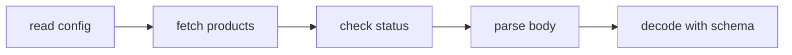
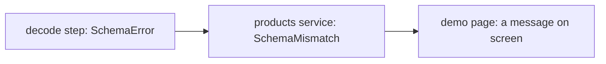

This chapter is bonus reading, and it is deliberately last. The course taught
you what the three channels are. This is about deciding what to put in them,
before any code exists.

It is adapted, with thanks, from
[Design Thinking](https://gist.github.com/r17x/90eb2f7be93932b5693753aedb09c01a)
by [r17x](https://github.com/r17x). The ideas and the order of the steps are
theirs. The plainer language and the examples from this course were added here,
along with any mistakes that came with them. The original is shorter and
sharper, and covers designing user interfaces as well, so read that too.

## The one sentence version

Draw the program as a picture of what calls what. Then write code that matches
the picture. If the code and the picture disagree, one of them is wrong, and it
is usually the code.

The picture has a name in the original: a **call graph**. It is simpler than it
sounds. Boxes are steps, and arrows are the data moving between them.



That is the capstone service from chapter nine, drawn before it was written.
Everything below is a question you ask about that picture.

## 1. Name the things first

You cannot draw the picture until you know what moves along the arrows.

There are four kinds of things worth naming:

- **Records.** The nouns of your problem. A user, a product, an order.
- **IDs.** How you tell one thing from another. Worth their own type rather
  than a bare `string`, so a product id cannot be passed where a user id was
  wanted.
- **Variants.** The states something can be in. Pending, active, cancelled. A
  step that is either "keep going" or "finished".
- **Errors.** The named ways things go wrong, from chapter five. Not strings.

Do this first and the rest of the design has words to use. Skip it and you will
find yourself writing `any` and hoping.

## 2. Draw the happy path

Now the picture, and only the success case. What goes in, what comes out, what
happens in between.

Ignore errors here. Ignore retries and timeouts. Those come later and they will
not change the shape.

This is the part people skip, and it is the part that saves the most time. A
picture is cheap to redraw. A program is not.

## 3. One value, or many over time?

Ask this of each step, because it decides which tool you reach for.

- **One value.** The step runs, produces a result, done. That is an `Effect`,
  and it is everything this course covered.
- **Many values over time.** The step keeps producing: a list of events, a
  subscription, pages pulled one after another. Effect has a `Stream` for this.
  This course did not cover it, so treat this as a signpost rather than a
  lesson. The three channels work the same way there.

Mark it on the picture. A step that produces many values has a different shape
from one that produces a single value, and finding that out after writing the
code is expensive.

## 4. Mark where it breaks

Go back over the picture and mark every arrow that can fail. Each one gets one
of three answers, and choosing is the whole job.

- **Try again.** The failure is temporary. A timeout, a rate limit, a 500.
- **Fall back.** The failure is expected and you have something else to offer.
  A cached value, a default, an empty list.
- **Let it die.** This is not a normal failure. It means an assumption you made
  is false, and the honest response is to crash and fix the code. Chapter five
  called this a defect.

Everything in the first two groups belongs in `E` as a value. Errors travel
along the arrows like any other data, and you decide at each step what to do
with them.

The capstone's `isRetryable` is this step written down as code. A 500 is "try
again", a 404 is not, and a decode failure never will be.

## 5. Mark what each step needs

For each box, ask: what must exist for this to work at all?

A database connection, an HTTP client, the current time, a config value. Write
it next to the box. That list is `R`, and chapter seven is how you say it in
the type.

The useful phrasing from the original is "we cannot do X if we don't have Y".
It turns a vague dependency into a requirement the compiler will check for you.
When `R` is `never`, everything the program needed has been supplied. Until
then, the compiler can tell you exactly what is missing.

## 6. Decide where you stop trusting

Find every place untrusted data enters the picture. An HTTP response, a form,
a file, an environment variable, anything from a third party.

Those are your boundaries, and they are the only places you check. Use a schema
there, from chapter six, and inside the boundary trust the types completely.

The failure mode to avoid is checking a little bit everywhere: a `?.` here, a
default there, a `typeof` check three layers in. That is the same work spread
thin, done badly, with no single place to fix.

## 7. Wrap behaviour around the picture, not inside it

Retries, timeouts, logging, tracing, caching. None of these change what the
program does, so none of them should change the picture.

They go on with `.pipe`, around the steps.

```ts twoslash
import { Effect, Schedule } from 'effect'
declare const fetchProducts: Effect.Effect<Array<string>, 'RequestFailed'>
// ---cut---
const resilient = fetchProducts.pipe(
  Effect.timeout('2 seconds'),
  Effect.retry(Schedule.exponential('200 millis')),
)
```

The picture says what happens. The wrapping says how it behaves when things are
slow or flaky. Keeping them apart is why you can read either one without the
other getting in the way.

## 8. Tie resources to a lifetime

If a step opens something, it has to close it. Connections, file handles,
sockets, child processes.

Effect has `Scope` for this, so closing is a guarantee rather than a `finally`
block somebody has to remember, and it holds even when the program fails or is
interrupted partway. This course did not cover it, so again, a signpost. The
design question is the one to keep: which steps open something, and when should
it close?

## 9. Prove the design by swapping R

Here is the test of whether the design is any good.

The picture must not change between production and a test. Same boxes, same
arrows, same failures. The only difference is what sits behind `R`.

Chapter ten is this step in practice. If a test needs a real server, or has to
patch a global, the design has a dependency it never admitted to. And if
testing one box means faking the whole world, that box is doing too much.

## 10. Let the code look like the picture

The last step is the one that shows up in every file you write.

`Effect.gen` is the picture. Each `yield*` is one box, in order, top to bottom.
`.pipe` after it is the failure handling. Chapter four gave this as a style
tip. Here is the reason behind it: they are two different drawings, and mixing
them means neither can be read.

```ts twoslash
import { Effect, Schema } from 'effect'
class NotFound extends Schema.TaggedError<NotFound>()('NotFound', {}) {}
declare const readFile: (path: string) => Effect.Effect<string, NotFound>
declare const parse: (raw: string) => Effect.Effect<number, NotFound>
// ---cut---
const load = Effect.gen(function* () {
  // the picture: three boxes, no error handling
  const raw = yield* readFile('port.txt')
  const port = yield* parse(raw)

  return port + 1
}).pipe(
  // the failure handling: everything the picture above can produce
  Effect.catchTag('NotFound', () => Effect.succeed(8080)),
  Effect.timeout('2 seconds'),
)
```

Before writing the `.pipe`, read the `E` of every step inside the `gen`. The
pipe should account for all of them. That is not a style rule, it is how you
know you did not miss one.

### Each layer cleans up after itself

This is the part most worth stealing, and the capstone already does it without
naming it.

A failure should not travel further than the layer that understands it. Each
layer catches what it received and turns it into something the next layer up
can actually act on.



In the capstone, `Schema.decodeUnknownEffect` fails with `SchemaError`. The
service catches that and produces `SchemaMismatch`, which is its own error with
its own meaning. The page catches that and shows something a person can read.

The page never sees `SchemaError`. It should not have to know that a schema was
involved, any more than it should know which HTTP library was used. Each layer
publishes its own vocabulary of failures, and hides the ones underneath.

### The one time error handling goes inside gen

Sometimes two steps in the same `gen` need different treatment. One should stop
everything, the other should quietly fall back.

The outer `.pipe` cannot tell which step a failure came from, so in that case,
and only that case, handle it inline at the step that produced it. The original
calls this a divergent strategy. It should be rare, and worth a comment when it
happens.

## The short version

Ten questions, roughly in the order they become answerable:

1. What are the things, and what are they called?
2. What does the happy path look like when nothing goes wrong?
3. Does each step produce one value, or many over time?
4. Where can it break, and is each break worth a retry, a fallback, or a crash?
5. What does each step need in order to work at all?
6. Where does data you did not create get in?
7. What behaviour wraps the steps without changing them?
8. What gets opened, and when does it close?
9. Would the same picture still run in a test, with something else behind `R`?
10. Does the code end up looking like the picture?

Nobody gets through these cleanly in one pass. Answering question six usually
sends you back to question two, and that is the cheap part of the work. Most of
the value is in the first two anyway, and the rest is detail you can fill in
once the shape is right.

## Why this is worth reading twice

The first time through the course, these steps would have been abstract advice.
Now every one of them has something concrete behind it: `isRetryable` is step
four, the `Fetcher` service is step nine, the schema at the boundary is step
six.

That is the reason this chapter is at the end rather than the beginning. You
cannot design with tools you have not used.
