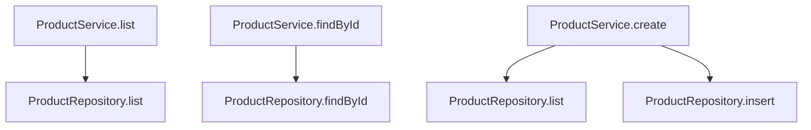

The usual way to start a service is to type `class ProductService extends` and
work it out as you go. It goes wrong in a specific way. Halfway through you
find that the error you defined belongs one layer down, the dependency you
reached for cannot be constructed where you are standing, and the method you
wrote returns something the caller cannot use.

Everything in this chapter is decided on paper. No new API appears. What comes
out of it is a list precise enough that chapters six and seven are mostly
transcription.

## Start with what calls what

Write the happy path only. No errors, no dependencies, no construction. Just
which operation calls which.



Three public operations, one collaborator. `create` calls `list` before
inserting because it has a rule to check first, which is already a hint about
where that rule lives.

This graph is small enough to feel pointless. Draw it anyway. The value is not
the picture, it is that you now have a finite list of edges, and every question
below gets asked once per edge.

## Two layers, and the line between them

The catalog needs somewhere to keep products and somewhere to decide what the
catalog means. Those are different jobs, so they are different services.

`ProductRepository` owns storage. It can list, find, and insert. It knows about
nothing else. Swap it for one backed by SQL later and none of its callers
change.

`ProductService` owns catalog behaviour. It decides that a missing product is
an error, that a full catalog rejects new products, and what a caller is
allowed to ask for.

The line is worth stating as a rule, because it is the decision people get
wrong most often. **The repository answers questions. The service decides what
the answers mean.**

That is why `ProductRepository.findById` returns `Option<Product>` rather than
failing. For a lookup, absence is a legitimate answer, not a malfunction. A
repository that decided absence was an error would be unusable by any caller
who wanted to check whether an id was free.

## Every failure gets exactly one owner

Now walk the edges and ask what can go wrong.

| Failure | Who produces it | Why there |
| --- | --- | --- |
| The product is not in the catalog | `ProductService.findById` | Absence becomes an error only because this caller asked for a specific product |
| The catalog is full | `ProductService.create` | The limit is a catalog rule. Storage does not have one |
| The input is not a valid product | the edge, before the service | Decoding happens where unknown input arrives |

The third row is the one people leave off. If the service took `unknown` and
decoded it, every method would carry `SchemaError` forever, and every caller
would handle a parse failure that could only come from a caller that had
already been checked. Decode once, at the outside, and the service's signatures
stay about the catalog.

Notice that the repository produces no failures at all in this design. For an
in-memory store that is honest. When it becomes a SQL repository it will gain a
storage failure, and the service will translate that into a catalog failure
rather than passing it upward. The seam is already in the right place.

## Write the channels down

For each public operation, commit to `A`, `E`, and `R` before implementing it.

| Operation | A | E | R |
| --- | --- | --- | --- |
| `list` | `ReadonlyArray<Product>` | `never` | `ProductService` |
| `findById` | `Product` | `ProductNotFoundError` | `ProductService` |
| `create` | `Product` | `CatalogCapacityError` | `ProductService` |

Written as types, that table is the target the next three chapters have to
hit.

```ts twoslash
import { Effect, Option, Schema } from 'effect'
const ProductId = Schema.String.pipe(Schema.brand('@Catalog/ProductId'))
type ProductId = Schema.Schema.Type<typeof ProductId>
interface Product {
  readonly id: ProductId
  readonly name: string
  readonly price: number
}
interface CreateProduct {
  readonly name: string
  readonly price: number
}
class ProductNotFoundError extends Schema.TaggedError<ProductNotFoundError>()(
  'ProductNotFoundError',
  { productId: ProductId, message: Schema.String },
) {}
class CatalogCapacityError extends Schema.TaggedError<CatalogCapacityError>()(
  'CatalogCapacityError',
  { maximum: Schema.Finite, message: Schema.String },
) {}
// ---cut---
type RepositoryFindById = (
  id: ProductId,
) => Effect.Effect<Option.Option<Product>>

type ServiceFindById = (
  id: ProductId,
) => Effect.Effect<Product, ProductNotFoundError>

type ServiceCreate = (
  input: CreateProduct,
) => Effect.Effect<Product, CatalogCapacityError>
```

The `Option` in the first line and its absence in the second is the whole
design, written down before any of it exists.

Two things in that table are claims worth checking later.

`findById` succeeds with a `Product`, not an `Option<Product>`. The `Option`
stops at the service. Converting it is the service's whole contribution to that
call.

`R` is `ProductService` alone, not `ProductService | ProductRepository`. The
repository is required while the service is being built, and that requirement
is satisfied by the service's own layer. Callers never learn the repository
exists. If `R` still mentions it after chapter seven, the wiring is wrong.

## Where the values come from

The last pass is dependencies. For each service, what does it need to exist at
all, and what does it need per call?

`ProductRepository` needs storage that outlives a single call, so it creates
state during construction. Each construction gets its own, which is what makes
two tests independent.

`ProductService` needs the repository, and it needs the catalog limit. Both are
read once when the service is constructed, not on every method call. A limit
that is read per call is a limit that can change halfway through a request.

Construction time versus call time is a real distinction here, and it is
visible in the code. Whatever the constructor reads becomes a closed-over
value, and whatever a method reads happens per invocation.

## What people get wrong

Putting the error in the wrong layer. A repository that fails with
`ProductNotFoundError` has made a business decision on behalf of every future
caller, and the next feature that wants to check whether an id is taken has to
catch an error to do it.

Making everything a service. A service earns its place when it has a
dependency, holds state, or has a second implementation you actually intend to
write. A function that formats a product name is a function. Wrapping it in
`Context.Service` adds a layer to wire and a requirement to satisfy in every
test, in exchange for nothing.

Designing for implementations you have not been asked for. The repository
interface here has three methods because the service calls three methods. Not
because a repository "should" have `update` and `delete`.

## Next

The design is now a list. Two services, three public operations, two failures,
one setting, one piece of state. [Services with
Context.Service](/learn/basic-effect/06-services) turns the first half of that
list into code, building the pattern from the problem it solves rather than
presenting it as a form to fill in.
