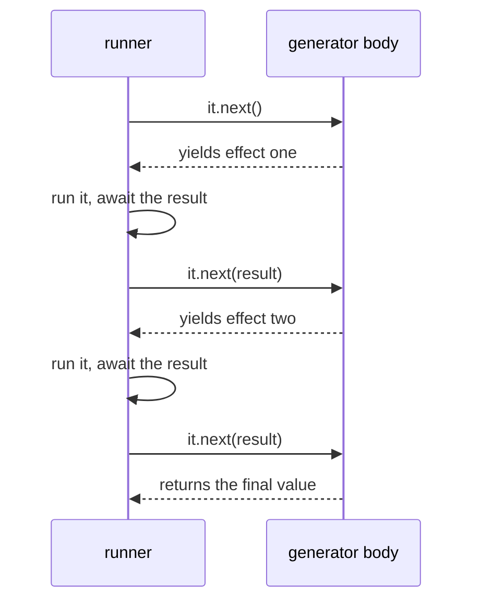

The helpers from the last chapter wrap one effect. Real programs have steps:
load a price, add tax, format it. With `async`/`await` you write that like this.

```ts twoslash
declare function loadPrice(id: number): Promise<number>
// ---cut---
async function priceWithTax(id: number): Promise<number> {
  const price = await loadPrice(id)
  return price * 1.2
}
```

It reads well, and it has the problem from chapter one in a new place. Calling
`priceWithTax(1)` runs everything. Each `await` pulls a value out of the work
so you can use it on the next line, which means the chain cannot exist without
running. You cannot hand `priceWithTax(1)` to `retry`, because there is
nothing left to retry. The work already happened.

What is missing is a way to say "then do this with the result" without taking
the result out.

## map and flatMap

`map` changes the result of an effect and returns another effect.

```ts twoslash
type Effect<A> = () => Promise<A>
// ---cut---
const map =
  <A, B>(f: (a: A) => B) =>
  (self: Effect<A>): Effect<B> =>
  async () =>
    f(await self())
```

The `await` is inside the function that has not run yet. Building `map(f)(effect)`
runs nothing, and the unwrapping happens later, when the new effect runs.

`flatMap` is for the next step that is itself an effect. If `f` returns an
effect, `map` would give you an effect of an effect, so `flatMap` runs the
inner one too.

```ts twoslash
type Effect<A> = () => Promise<A>
// ---cut---
const flatMap =
  <A, B>(f: (a: A) => Effect<B>) =>
  (self: Effect<A>): Effect<B> =>
  async () =>
    f(await self())()
```

Both are an assembly line. Building the line does not start a worker. Work
starts when the belt turns, which is the call to `runPromise`.

```ts twoslash
// mini-effect.ts
export interface Effect<A> {
  (): Promise<A>
  [Symbol.iterator](): Generator<Effect<A>, A, any>
}

export const make = <A>(run: () => Promise<A>): Effect<A> => {
  const self: Effect<A> = Object.assign(run, {
    *[Symbol.iterator]() {
      return (yield self) as A
    },
  })
  return self
}

export const succeed = <A>(a: A) => make(async () => a)
export const sync = <A>(f: () => A) => make(async () => f())
export const promise = <A>(f: () => Promise<A>) => make(f)
export const fail = (error: unknown) =>
  make<never>(async () => {
    throw error
  })

export const runPromise = <A>(self: Effect<A>): Promise<A> => self()

export function pipe<A>(a: A): A
export function pipe<A, B>(a: A, ab: (a: A) => B): B
export function pipe<A, B, C>(a: A, ab: (a: A) => B, bc: (b: B) => C): C
export function pipe<A, B, C, D>(a: A, ab: (a: A) => B, bc: (b: B) => C, cd: (c: C) => D): D
export function pipe(a: unknown, ...fns: Array<(x: unknown) => unknown>) {
  return fns.reduce((x, f) => f(x), a)
}

export const map =
  <A, B>(f: (a: A) => B) =>
  (self: Effect<A>) =>
    make(async () => f(await self()))

export const flatMap =
  <A, B>(f: (a: A) => Effect<B>) =>
  (self: Effect<A>) =>
    make(async () => f(await self())())

export const gen = <A>(body: () => Generator<Effect<any>, A, any>) =>
  make(async () => {
    const it = body()
    let step = it.next()
    while (!step.done) step = it.next(await step.value())
    return step.value
  })

export const repeat =
  (n: number) =>
  <A>(self: Effect<A>) =>
    make(async () => {
      const out: A[] = []
      for (let i = 0; i < n; i++) out.push(await self())
      return out
    })

export const retry =
  (n: number) =>
  <A>(self: Effect<A>) =>
    make(async () => {
      for (let i = 0; ; i++) {
        try {
          return await self()
        } catch (error) {
          if (i >= n) throw error
        }
      }
    })

export const timed =
  (label: string) =>
  <A>(self: Effect<A>) =>
    make(async () => {
      const start = Date.now()
      try {
        return await self()
      } finally {
        console.log(`${label} took ${Date.now() - start}ms`)
      }
    })

export const timeout =
  (ms: number) =>
  <A>(self: Effect<A>) =>
    make(() => {
      let timer: ReturnType<typeof setTimeout>
      const limit = new Promise<never>((_, reject) => {
        timer = setTimeout(() => reject(new Error(`timed out after ${ms}ms`)), ms)
      })
      return Promise.race([self(), limit]).finally(() => clearTimeout(timer))
    })
// ---cut---
const loadPrice = (id: number) => sync(() => id * 10)

const priceWithTax = (id: number) =>
  pipe(
    loadPrice(id),
    map((price) => price * 1.2),
  )

const wholeOrder = pipe(
  priceWithTax(1),
  flatMap((first) => pipe(priceWithTax(2), map((second) => first + second))),
)
```

`wholeOrder` is a value. It has not loaded either price. Run it twice and it
loads them twice, because a recipe can be cooked again.

## Reading it like normal code

The nesting in `wholeOrder` is already worse than the `async` version, and it
gets worse with each step. Effect's answer is to let you write the steps in
order and describe them with a generator.

A generator function, written `function*`, is a function that can pause. Each
`yield` hands a value to whoever is running it and waits to be resumed with an
answer. `yield*` is the form that delegates to something else that can be
yielded from.

Make an effect something `yield*` can walk by giving it one method. That
changes the type, so start there.

```ts twoslash
export interface Effect<A> {
  (): Promise<A>
  [Symbol.iterator](): Generator<Effect<A>, A, any>
}
```

The first two lines are the effect as before, a function that returns a
Promise. The new line says an effect can also be walked by `yield*`, and its
return type is `Generator`.

`Generator` is a type that TypeScript already has, and you do not declare it. It
describes the object a `function*` gives back, and it takes three type
arguments:

```
Generator<Effect<A>, A, any>
          │          │  └─ what the runner can send back in with it.next(value)
          │          └──── what the generator returns at the end
          └─────────────── what the generator yields out to the runner
```

Here the effect yields itself to the runner, which is the `Effect<A>`. It
returns an `A` at the end. The last slot is `any` because the runner sends back
whatever result the effect produced, and that type differs from one effect to
the next.

Now `make`, the one place that builds an effect and attaches that method.

```ts twoslash
interface Effect<A> {
  (): Promise<A>
  [Symbol.iterator](): Generator<Effect<A>, A, any>
}
// ---cut---
export const make = <A>(run: () => Promise<A>): Effect<A> => {
  const self: Effect<A> = Object.assign(run, {
    *[Symbol.iterator]() {
      return (yield self) as A
    },
  })
  return self
}
```

`[Symbol.iterator]` is the method `yield*` looks for. This one is tiny. It
yields the effect itself, once, and returns whatever the runner sends back in.
Every effect is built through `make` from here on, so every effect has it.

All the work is in the runner, and it is about five lines.

```ts twoslash
interface Effect<A> {
  (): Promise<A>
  [Symbol.iterator](): Generator<Effect<A>, A, any>
}
declare const make: <A>(run: () => Promise<A>) => Effect<A>
// ---cut---
export const gen = <A>(body: () => Generator<Effect<any>, A, any>) =>
  make(async () => {
    const it = body()
    let step = it.next()
    while (!step.done) step = it.next(await step.value())
    return step.value
  })
```

`it.next()` starts the generator and runs it to its first `yield*`. The step
holds the effect that was yielded. The runner runs that effect, then calls
`it.next(result)` to resume the generator with the answer. When the generator
returns, `step.done` is true and `step.value` is the final result.



Now the chain reads like `async` code and still runs nothing.

```ts twoslash
// mini-effect.ts
export interface Effect<A> {
  (): Promise<A>
  [Symbol.iterator](): Generator<Effect<A>, A, any>
}

export const make = <A>(run: () => Promise<A>): Effect<A> => {
  const self: Effect<A> = Object.assign(run, {
    *[Symbol.iterator]() {
      return (yield self) as A
    },
  })
  return self
}

export const succeed = <A>(a: A) => make(async () => a)
export const sync = <A>(f: () => A) => make(async () => f())
export const promise = <A>(f: () => Promise<A>) => make(f)
export const fail = (error: unknown) =>
  make<never>(async () => {
    throw error
  })

export const runPromise = <A>(self: Effect<A>): Promise<A> => self()

export function pipe<A>(a: A): A
export function pipe<A, B>(a: A, ab: (a: A) => B): B
export function pipe<A, B, C>(a: A, ab: (a: A) => B, bc: (b: B) => C): C
export function pipe<A, B, C, D>(a: A, ab: (a: A) => B, bc: (b: B) => C, cd: (c: C) => D): D
export function pipe(a: unknown, ...fns: Array<(x: unknown) => unknown>) {
  return fns.reduce((x, f) => f(x), a)
}

export const map =
  <A, B>(f: (a: A) => B) =>
  (self: Effect<A>) =>
    make(async () => f(await self()))

export const flatMap =
  <A, B>(f: (a: A) => Effect<B>) =>
  (self: Effect<A>) =>
    make(async () => f(await self())())

export const gen = <A>(body: () => Generator<Effect<any>, A, any>) =>
  make(async () => {
    const it = body()
    let step = it.next()
    while (!step.done) step = it.next(await step.value())
    return step.value
  })

export const repeat =
  (n: number) =>
  <A>(self: Effect<A>) =>
    make(async () => {
      const out: A[] = []
      for (let i = 0; i < n; i++) out.push(await self())
      return out
    })

export const retry =
  (n: number) =>
  <A>(self: Effect<A>) =>
    make(async () => {
      for (let i = 0; ; i++) {
        try {
          return await self()
        } catch (error) {
          if (i >= n) throw error
        }
      }
    })

export const timed =
  (label: string) =>
  <A>(self: Effect<A>) =>
    make(async () => {
      const start = Date.now()
      try {
        return await self()
      } finally {
        console.log(`${label} took ${Date.now() - start}ms`)
      }
    })

export const timeout =
  (ms: number) =>
  <A>(self: Effect<A>) =>
    make(() => {
      let timer: ReturnType<typeof setTimeout>
      const limit = new Promise<never>((_, reject) => {
        timer = setTimeout(() => reject(new Error(`timed out after ${ms}ms`)), ms)
      })
      return Promise.race([self(), limit]).finally(() => clearTimeout(timer))
    })
// ---cut---
const loadPrice = (id: number) => sync(() => id * 10)

const wholeOrder = gen(function* () {
  const first = yield* loadPrice(1)
  const second = yield* loadPrice(2)
  return (first + second) * 1.2
})
```

`yield*` means "run this effect and give me its result". It plays the part of
`await`. Hover `first` in your editor and it is a `number`, which is the value
the effect produces, not the effect.

`wholeOrder` is a recipe like any other. Pass it to `retry`, `timed`, or
`runPromise`, as many times as you like.

## The part people get wrong

`await` and `yield*` are different keywords in different kinds of function, and
mixing up their habits breaks in two ways.

The first is forgetting the `*`:

```ts
const wholeOrder = gen(function* () {
  const first = loadPrice(1) // an Effect<number>, not a number
  return first * 2 // type error
})
```

Without `yield*` nothing runs, and `first` is the recipe. The type error is
your friend here.

The second is reaching for `await` inside the body. A `function*` cannot use
`await`, so write `yield*` and let the runner do the waiting. Inside `gen`,
`yield*` is the only step that runs anything.

## Try it

Take `wholeOrder` from the `flatMap` version, add a third price, and rewrite
it with `gen`. Check that both give the same total, and that building either
one prints nothing until you run it.

Here is `mini-effect.ts` as it stands. Every effect is now built through `make`,
so `succeed`, `retry` and the others from last chapter wrap their function in
it. The demo builds two versions of the same pipeline, runs one of them twice,
and shows that loading only happens on a run.

```ts twoslash
// mini-effect.ts
export interface Effect<A> {
  (): Promise<A>
  [Symbol.iterator](): Generator<Effect<A>, A, any>
}

export const make = <A>(run: () => Promise<A>): Effect<A> => {
  const self: Effect<A> = Object.assign(run, {
    *[Symbol.iterator]() {
      return (yield self) as A
    },
  })
  return self
}

export const succeed = <A>(a: A) => make(async () => a)
export const sync = <A>(f: () => A) => make(async () => f())
export const promise = <A>(f: () => Promise<A>) => make(f)
export const fail = (error: unknown) =>
  make<never>(async () => {
    throw error
  })

export const runPromise = <A>(self: Effect<A>): Promise<A> => self()

export function pipe<A>(a: A): A
export function pipe<A, B>(a: A, ab: (a: A) => B): B
export function pipe<A, B, C>(a: A, ab: (a: A) => B, bc: (b: B) => C): C
export function pipe<A, B, C, D>(a: A, ab: (a: A) => B, bc: (b: B) => C, cd: (c: C) => D): D
export function pipe(a: unknown, ...fns: Array<(x: unknown) => unknown>) {
  return fns.reduce((x, f) => f(x), a)
}

export const map =
  <A, B>(f: (a: A) => B) =>
  (self: Effect<A>) =>
    make(async () => f(await self()))

export const flatMap =
  <A, B>(f: (a: A) => Effect<B>) =>
  (self: Effect<A>) =>
    make(async () => f(await self())())

export const gen = <A>(body: () => Generator<Effect<any>, A, any>) =>
  make(async () => {
    const it = body()
    let step = it.next()
    while (!step.done) step = it.next(await step.value())
    return step.value
  })

export const repeat =
  (n: number) =>
  <A>(self: Effect<A>) =>
    make(async () => {
      const out: A[] = []
      for (let i = 0; i < n; i++) out.push(await self())
      return out
    })

export const retry =
  (n: number) =>
  <A>(self: Effect<A>) =>
    make(async () => {
      for (let i = 0; ; i++) {
        try {
          return await self()
        } catch (error) {
          if (i >= n) throw error
        }
      }
    })

export const timed =
  (label: string) =>
  <A>(self: Effect<A>) =>
    make(async () => {
      const start = Date.now()
      try {
        return await self()
      } finally {
        console.log(`${label} took ${Date.now() - start}ms`)
      }
    })

export const timeout =
  (ms: number) =>
  <A>(self: Effect<A>) =>
    make(() => {
      let timer: ReturnType<typeof setTimeout>
      const limit = new Promise<never>((_, reject) => {
        timer = setTimeout(() => reject(new Error(`timed out after ${ms}ms`)), ms)
      })
      return Promise.race([self(), limit]).finally(() => clearTimeout(timer))
    })

const assert = (ok: boolean, message: string): void => {
  if (!ok) throw new Error(message)
}

const demo = async () => {
  const price = (id: number) => sync(() => (console.log(`load price ${id}`), id * 10))

  const viaFlatMap = pipe(
    price(1),
    flatMap((a) => pipe(price(2), map((b) => a + b))),
    map((total) => total * 2),
  )
  const viaGen = gen(function* () {
    const a = yield* price(1)
    const b = yield* price(2)
    return (a + b) * 2
  })

  console.log('built both, nothing loaded yet')
  assert((await runPromise(viaFlatMap)) === 60, 'flatMap chain')
  assert((await runPromise(viaGen)) === 60, 'gen')
  assert((await runPromise(viaGen)) === 60, 'a recipe runs again')
  console.log('both give 60, and viaGen ran twice')
}

await demo()
```

```sh
built both, nothing loaded yet
load price 1
load price 2
load price 1
load price 2
load price 1
load price 2
both give 60, and viaGen ran twice
```

One thing is still missing, and it has been in the way since chapter one. Both
`await` and `yield*` take a result for granted, and real work can fail. The
next chapter makes failure part of the type:
[Failure is a value](/learn/effect-from-scratch/05-failure-is-a-value).
