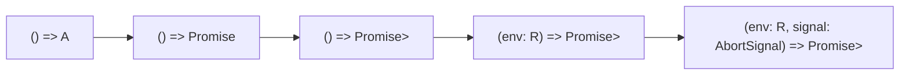

Effect looks like a large library. This track shows that the core of it is a
handful of small functions around one idea, and you write those functions
yourself.

The idea is a function you have not called yet.

```ts twoslash
type Effect<A> = () => A
```

Everything else is a reaction to a problem that line leaves standing. A
function that does work when you call it cannot be retried, timed or skipped
without editing it. A function that only describes work can. Each chapter picks
one problem, widens that type just enough to fix it, and adds the helpers the
wider type allows.

## What you build

One file, `mini-effect.ts`, with no dependencies. It runs with `bun`, and it
grows chapter by chapter until it has the parts you will meet in Effect:



The replica uses Effect's own names, `succeed`, `sync`, `map`, `flatMap`,
`gen`, `retry` and `runPromise`. The last chapter puts it next to the real
library, and the comparison is mostly a rename.

## How to read it

Every chapter opens with a problem in code you could have written yourself, and
only then defines the thing that fixes it. Each ends with the file as it stands
and a short demo you can run with `bun mini-effect.ts`.

Type the code instead of pasting it. The point is to feel how little each piece
is.

The replica is a model, not a library. It has the idea and none of the safety,
and the last chapter says exactly what is missing.

## Chapters

1. [The eager problem](/learn/effect-from-scratch/01-the-eager-problem)
2. [A value that holds work](/learn/effect-from-scratch/02-a-value-that-holds-work)
3. [The first superpowers](/learn/effect-from-scratch/03-the-first-superpowers)
4. [Composing without running](/learn/effect-from-scratch/04-composing-without-running)
5. [Failure is a value](/learn/effect-from-scratch/05-failure-is-a-value)
6. [Needing things](/learn/effect-from-scratch/06-needing-things)
7. [The end of the world](/learn/effect-from-scratch/07-the-end-of-the-world)
8. [What Effect adds](/learn/effect-from-scratch/08-what-effect-adds)

You do not need Effect for any of this. When you want the real API, read
[Basic Effect](/learn/basic-effect) after this track, or before it if you
prefer to start from the library and work down.
