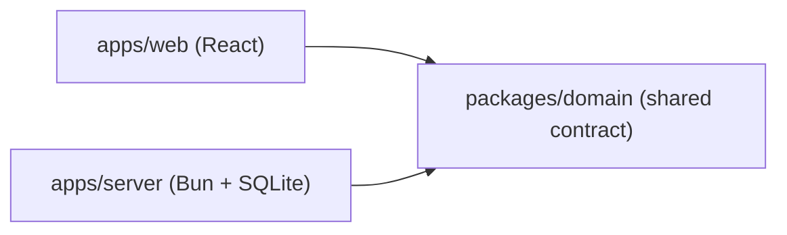

Most full stack apps describe their data twice. The backend has a `Todo` type,
the frontend has its own `Todo` type, and the only thing keeping them the same
is a person remembering to update both. Rename a field on one side and nothing
complains until a user sees a blank screen.

This track builds a small todo app where that cannot happen. You will create
every file yourself, from an empty folder to a page in the browser, and each
chapter ends with a command that proves the step works.

## What you will build

The app does two things: add a todo, and list all todos. That is small on
purpose. Two features are enough to touch every layer of a real app without the
todo logic getting in the way.

The code lives in one repository, split into three packages:



- `packages/domain` holds the shared pieces: what a todo looks like, and a
  description of the HTTP API.
- `apps/server` reads that description and answers the requests, storing todos
  in a SQLite file.
- `apps/web` is a React page. It reads the same description and gets a fully
  typed client for free, so nobody writes a `fetch` or a URL by hand.

The arrows are the only imports allowed. The server and the web page never
import each other. They only agree through `domain`, and TypeScript checks that
agreement every time you build.

## What you need

- [Bun](https://bun.sh) 1.4 or newer. It is the package manager, the server
  runtime and the test runner here.
- A code editor that uses the project's TypeScript version.
- Basic TypeScript and React. You do not need to know Effect. Every Effect idea
  gets a plain explanation the first time it shows up, with a link to the
  [Basic Effect](/learn/basic-effect) track if you want the longer story.

The versions are pinned exactly:

```sh
effect@4.0.0-rc.117
@effect/platform-bun@4.0.0-rc.117
@effect/sql-sqlite-bun@4.0.0-rc.117
@effect/atom-react@4.0.0-rc.117
@effect/vitest@4.0.0-rc.117
typescript@7.0.2
```

Effect v4 is a release candidate, and every `effect` and `@effect/*` package
shares one version number. Mixing versions is the fastest way to get type
errors that make no sense, so keep them identical.

Several modules come from paths like `effect/unstable/http` and
`effect/unstable/sql`. They live inside the `effect` package itself, and the
word `unstable` is honest: their names can still change before v4 is final.

## How the chapters work

Each chapter adds one piece, in the order you would build it for real:

1. The workspace and its tooling.
2. The todo, described once in the shared package.
3. The API, described as a value.
4. A repository over SQLite.
5. The handlers that answer each request.
6. Serving it on a port.
7. A test for the whole API.
8. The typed client for the browser.
9. The React page, and running everything together.

The code in every chapter is the code of a finished, working repository. When a
file grows over several steps, you will see the small version first and the
complete version at the end, so what you have matches the real thing.

Start with [the workspace shape](/learn/fullstack-monorepo/01-the-workspace-shape).
