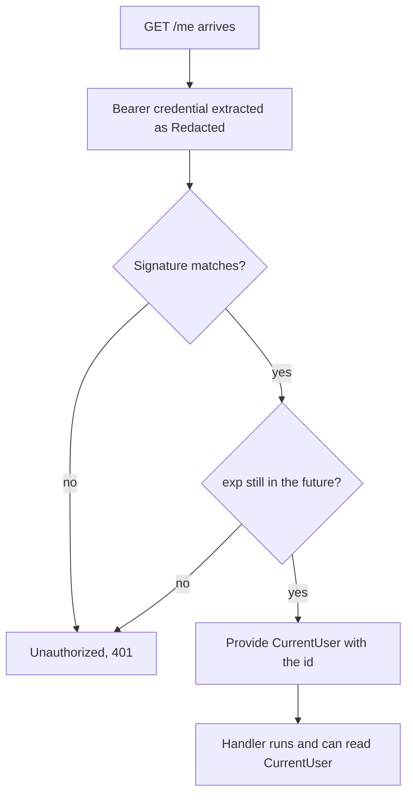

`/me` needs to know who is asking. So does every endpoint added after it. The
version where each handler works that out for itself starts like this:

```js
const header = req.headers.authorization
const token = header?.slice('Bearer '.length)
if (!token) return res.status(401).end()
```

Three endpoints later there are three copies, one of them checks expiry and two
forgot, and the one written on a Friday does `header.split(' ')[1]` and crashes
on a request with no header at all.

The work is identical every time, so it should happen once, before the handler
runs. Code that sits in front of a handler like that is **middleware**.

## Two halves, kept apart

An Effect middleware is written in two pieces, and the split matters.

The **declaration** says what it needs from the request, what it gives the
handler, and how it can fail. It lives beside the API, because it is part of
the contract: an endpoint behind this middleware needs a token, and a
documentation page should say so.

The **implementation** does the checking. It lives with the server code, and
nothing outside the server should ever see it, because it is the half that
holds the secret.

## Declaring it

Start with the failure, in the file the others are in. One error covers every
way a request can fail to prove who it is.

```ts twoslash
import { Schema } from 'effect'
// ---cut---
// src/errors.ts
export class Unauthorized extends Schema.TaggedError<Unauthorized>()(
  'Unauthorized',
  { message: Schema.String },
  { httpApiStatus: 401 },
) {}
```

Then what the handler is given. `CurrentUser` is a service with no
implementation of its own, because it is not built at startup. It is produced
per request, by the middleware, and only exists behind it.

```ts twoslash
// @filename: src/domain.ts
import { Schema } from 'effect'
import { Model } from 'effect/unstable/schema'

export const UserId = Schema.String.pipe(Schema.brand('UserId'))

export const Email = Schema.String.pipe(
  Schema.check(
    Schema.isPattern(/^[^\s@]+@[^\s@]+\.[^\s@]+$/, { message: 'Not a valid email' }),
  ),
  Schema.brand('Email'),
)

export const Password = Schema.String.pipe(
  Schema.check(Schema.isMinLength(6, { message: 'Too short' })),
)

export const RegisterPayload = Schema.Struct({
  name: Schema.String,
  email: Email,
  password: Password,
})
export type RegisterPayload = typeof RegisterPayload.Type

export const LoginPayload = Schema.Struct({
  email: Email,
  password: Schema.String,
})
export type LoginPayload = typeof LoginPayload.Type

export const LoginResult = Schema.Struct({ token: Schema.String })

export class User extends Model.Class<User>('User')({
  id: Model.UuidV7Insert(UserId),
  name: Schema.String,
  email: Email,
  passwordHash: Model.Sensitive(Schema.String),
  createdAt: Model.DateTimeInsert,
}) {}
// @filename: src/errors.ts
import { Schema } from 'effect'

export class EmailAlreadyTaken extends Schema.TaggedError<EmailAlreadyTaken>()(
  'EmailAlreadyTaken',
  { email: Schema.String },
  { httpApiStatus: 409 },
) {}

export class InvalidCredentials extends Schema.TaggedError<InvalidCredentials>()(
  'InvalidCredentials',
  {},
  { httpApiStatus: 401 },
) {}

export class ValidationFailed extends Schema.TaggedError<ValidationFailed>()(
  'ValidationFailed',
  {
    issues: Schema.Array(
      Schema.Struct({ path: Schema.String, message: Schema.String }),
    ),
  },
  { httpApiStatus: 400 },
) {}

export class Unauthorized extends Schema.TaggedError<Unauthorized>()(
  'Unauthorized',
  { message: Schema.String },
  { httpApiStatus: 401 },
) {}
// @filename: src/api.ts
// ---cut---
// src/api.ts
import { Context } from 'effect'
import { HttpApiMiddleware, HttpApiSecurity } from 'effect/unstable/httpapi'
import { UserId } from './domain'
import { Unauthorized } from './errors'

export class CurrentUser extends Context.Service<
  CurrentUser,
  { readonly userId: typeof UserId.Type }
>()('CurrentUser') {}

export class Authorization extends HttpApiMiddleware.Service<
  Authorization,
  { provides: CurrentUser; requires: never }
>()('Authorization', {
  security: { bearer: HttpApiSecurity.bearer },
  error: Unauthorized,
}) {}
```

Three things about that declaration are easy to get wrong.

`provides` and `requires` go in the type argument, in the angle brackets, not
in the options object below. `provides` is what handlers get. `requires` is
what the middleware itself needs from elsewhere, and this one needs nothing, so
it is `never`.

`security` is a record of named schemes rather than a single one, so
`{ bearer: ... }` and not `HttpApiSecurity.bearer` on its own. The name comes
back in the implementation.

`HttpApiSecurity.bearer` is a value, not a function. There are no brackets
after it.

`CurrentUser` holds only an id. It could hold the whole user, and then `/me`
would need no database at all, which sounds better than it is. A token lives an
hour, so a name copied into it is a name that can be an hour out of date. The
next chapter reads the row instead.

## Implementing it

The implementation is a layer that returns one function per named scheme.

```ts twoslash
// @filename: src/domain.ts
import { Schema } from 'effect'
import { Model } from 'effect/unstable/schema'

export const UserId = Schema.String.pipe(Schema.brand('UserId'))

export const Email = Schema.String.pipe(
  Schema.check(
    Schema.isPattern(/^[^\s@]+@[^\s@]+\.[^\s@]+$/, { message: 'Not a valid email' }),
  ),
  Schema.brand('Email'),
)

export const Password = Schema.String.pipe(
  Schema.check(Schema.isMinLength(6, { message: 'Too short' })),
)

export const RegisterPayload = Schema.Struct({
  name: Schema.String,
  email: Email,
  password: Password,
})
export type RegisterPayload = typeof RegisterPayload.Type

export const LoginPayload = Schema.Struct({
  email: Email,
  password: Schema.String,
})
export type LoginPayload = typeof LoginPayload.Type

export const LoginResult = Schema.Struct({ token: Schema.String })

export class User extends Model.Class<User>('User')({
  id: Model.UuidV7Insert(UserId),
  name: Schema.String,
  email: Email,
  passwordHash: Model.Sensitive(Schema.String),
  createdAt: Model.DateTimeInsert,
}) {}
// @filename: src/errors.ts
import { Schema } from 'effect'

export class EmailAlreadyTaken extends Schema.TaggedError<EmailAlreadyTaken>()(
  'EmailAlreadyTaken',
  { email: Schema.String },
  { httpApiStatus: 409 },
) {}

export class InvalidCredentials extends Schema.TaggedError<InvalidCredentials>()(
  'InvalidCredentials',
  {},
  { httpApiStatus: 401 },
) {}

export class ValidationFailed extends Schema.TaggedError<ValidationFailed>()(
  'ValidationFailed',
  {
    issues: Schema.Array(
      Schema.Struct({ path: Schema.String, message: Schema.String }),
    ),
  },
  { httpApiStatus: 400 },
) {}

export class Unauthorized extends Schema.TaggedError<Unauthorized>()(
  'Unauthorized',
  { message: Schema.String },
  { httpApiStatus: 401 },
) {}
// @filename: src/api.ts
import { Context } from 'effect'
import {
  HttpApi,
  HttpApiEndpoint,
  HttpApiGroup,
  HttpApiMiddleware,
  HttpApiSchema,
  HttpApiSecurity,
} from 'effect/unstable/httpapi'
import {
  LoginPayload,
  LoginResult,
  RegisterPayload,
  User,
  UserId,
} from './domain'
import {
  EmailAlreadyTaken,
  InvalidCredentials,
  Unauthorized,
  ValidationFailed,
} from './errors'

export class CurrentUser extends Context.Service<
  CurrentUser,
  { readonly userId: typeof UserId.Type }
>()('CurrentUser') {}

export class Authorization extends HttpApiMiddleware.Service<
  Authorization,
  { provides: CurrentUser; requires: never }
>()('Authorization', {
  security: { bearer: HttpApiSecurity.bearer },
  error: Unauthorized,
}) {}

export const register = HttpApiEndpoint.post('register', '/register', {
  payload: RegisterPayload,
  success: User.json.pipe(HttpApiSchema.status(201)),
  error: EmailAlreadyTaken,
})

export const login = HttpApiEndpoint.post('login', '/login', {
  payload: LoginPayload,
  success: LoginResult,
  error: InvalidCredentials,
})

export const me = HttpApiEndpoint.get('me', '/me', {
  success: User.json,
}).middleware(Authorization)

export class ErrorHandler extends HttpApiMiddleware.Service<ErrorHandler>()(
  'ErrorHandler',
  { error: ValidationFailed },
) {}

export const AuthApi = HttpApi.make('AuthApi')
  .add(HttpApiGroup.make('auth').add(register, login, me))
  .middleware(ErrorHandler)
// @filename: src/auth.ts
import { Config, Context, Effect, Layer, Redacted, Schema } from 'effect'
import { password } from 'bun'
import { SignJWT, jwtVerify } from 'jose'
import { UserId } from './domain'

export class PasswordHasher extends Context.Service<PasswordHasher>()('PasswordHasher', {
  make: Effect.sync(() => ({
    hash: (plain: string) => Effect.promise(() => password.hash(plain)),
    verify: (plain: string, hashed: string) =>
      Effect.promise(() => password.verify(plain, hashed)),
  })),
}) {
  static readonly layer = Layer.effect(this, this.make)
}

export class Tokens extends Context.Service<Tokens>()('Tokens', {
  make: Effect.gen(function* () {
    const secret = yield* Config.Redacted('JWT_SECRET')
    const key = new TextEncoder().encode(Redacted.value(secret))

    const issue = (userId: string) =>
      Effect.promise(() =>
        new SignJWT({})
          .setProtectedHeader({ alg: 'HS256' })
          .setSubject(userId)
          .setIssuedAt()
          .setExpirationTime('1h')
          .sign(key),
      )

    const verify = (token: string) => Effect.tryPromise(() => jwtVerify(token, key))

    return { issue, verify } as const
  }),
}) {
  static readonly layer = Layer.effect(this, this.make)
}
// ---cut---
// src/auth.ts, below the error handler
import { Authorization, CurrentUser } from './api'
import { Unauthorized } from './errors'

export const AuthorizationLayer = Layer.effect(
  Authorization,
  Effect.gen(function* () {
    const tokens = yield* Tokens

    const verifyToken = Effect.fn('verifyToken')(
      function* (token: string) {
        const result = yield* tokens.verify(token)
        return yield* Schema.decodeUnknownEffect(UserId)(result.payload.sub)
      },
      Effect.catch(() => new Unauthorized({ message: 'Invalid token' })),
    )

    return Authorization.of({
      bearer: Effect.fn(function* (httpEffect, { credential }) {
        const userId = yield* verifyToken(Redacted.value(credential))

        return yield* Effect.provideService(httpEffect, CurrentUser, { userId })
      }),
    })
  }),
)
```

`Tokens` is pulled once, when the layer is built, rather than on every request.
That is why
[me and the public user](/learn/http-auth-api/07-me-and-the-public-user) hands
it to this layer separately from the services the handlers use.

`bearer` is the scheme name from the declaration. `credential` arrives already
pulled out of the `Authorization` header, already stripped of the `Bearer `
prefix, and already wrapped in a `Redacted`. That is the inbound direction the
last chapter promised: a token that reaches you by accident in a log line is
worth as much as a password, so it comes boxed, and `Redacted.value` is the
deliberate act of opening it.

`httpEffect` is the handler, waiting. Returning it with a service attached runs
it. Failing instead means it never runs at all.

## What verifying means

`verifyToken` is two lines and one catch, and the catch is doing more work than
it looks like. Three separate things can go wrong, and all three end the same
way.

The signature can fail to match, which means the token was edited or was made
with a different secret. Somebody is trying something.

The signature can be fine and `exp` already past, which means this was a real
token an hour ago. Nobody is trying anything, they just took too long. It is
still a 401, because the alternative is a token that never stops working.

Or the token is valid and has no `sub` in it, which is why the subject goes
through `Schema.decodeUnknownEffect` rather than being read off the payload. A
signed token is not automatically a token this service issued.

The first two come out of `jose` as a rejected promise, which is why
[signing the token](/learn/http-auth-api/05-signing-the-token) wraps `verify`
in `Effect.tryPromise`. Wrap it in `Effect.promise` instead and none of this
catches: a bad token stops being a 401 and becomes a 500.

## Putting it in front of one endpoint

`/me` is the only endpoint here that needs a caller to prove who they are.
Register and login are how a caller gets a token in the first place, so gating
those two would leave nobody able to get one. Middleware attaches to a single
endpoint, and that is the only change `api.ts` needs.

```ts
// src/api.ts, replacing the me endpoint
export const me = HttpApiEndpoint.get('me', '/me', {
  success: User.json,
}).middleware(Authorization)
```

`Unauthorized` never appears on `register` or `login`, and never had to be
written on `me` either. It came with the middleware.

The same call also works on a group, and then every endpoint in the group is
gated. That is the right shape for an admin group where everything needs a
token, and the wrong one here, so do not make this change to `authGroup`.

```ts
// not this project, and not an edit to make
HttpApiGroup.make('admin').add(listUsers, deleteUser).middleware(Authorization)
```

Endpoints added to a group after that call do not get the middleware, which is
worth knowing before it surprises you.

## Wiring it up

Declaring the middleware on an endpoint is a promise the compiler now holds you
to. Start the server as it stands and it refuses to build, because `AuthApi`
needs an `Authorization` and nothing in `main.ts` has one:

```
Type 'Effect<never, SqlError | ConfigError | ServeError, Authorization>' is not
assignable to parameter of type 'Effect<never, SqlError | ConfigError | ServeError, never>'.
  Type 'Authorization' is not assignable to type 'never'.
```

`AuthorizationLayer` is what satisfies it, and it goes beside the other two
layers rather than inside `provideRequest`, because it is built once at startup
and not per request.

```ts twoslash
// @filename: src/domain.ts
import { Schema } from 'effect'
import { Model } from 'effect/unstable/schema'

export const UserId = Schema.String.pipe(Schema.brand('UserId'))

export const Email = Schema.String.pipe(
  Schema.check(
    Schema.isPattern(/^[^\s@]+@[^\s@]+\.[^\s@]+$/, { message: 'Not a valid email' }),
  ),
  Schema.brand('Email'),
)

export const Password = Schema.String.pipe(
  Schema.check(Schema.isMinLength(6, { message: 'Too short' })),
)

export const RegisterPayload = Schema.Struct({
  name: Schema.String,
  email: Email,
  password: Password,
})
export type RegisterPayload = typeof RegisterPayload.Type

export const LoginPayload = Schema.Struct({
  email: Email,
  password: Schema.String,
})
export type LoginPayload = typeof LoginPayload.Type

export const LoginResult = Schema.Struct({ token: Schema.String })

export class User extends Model.Class<User>('User')({
  id: Model.UuidV7Insert(UserId),
  name: Schema.String,
  email: Email,
  passwordHash: Model.Sensitive(Schema.String),
  createdAt: Model.DateTimeInsert,
}) {}
// @filename: src/errors.ts
import { Schema } from 'effect'

export class EmailAlreadyTaken extends Schema.TaggedError<EmailAlreadyTaken>()(
  'EmailAlreadyTaken',
  { email: Schema.String },
  { httpApiStatus: 409 },
) {}

export class InvalidCredentials extends Schema.TaggedError<InvalidCredentials>()(
  'InvalidCredentials',
  {},
  { httpApiStatus: 401 },
) {}

export class ValidationFailed extends Schema.TaggedError<ValidationFailed>()(
  'ValidationFailed',
  {
    issues: Schema.Array(
      Schema.Struct({ path: Schema.String, message: Schema.String }),
    ),
  },
  { httpApiStatus: 400 },
) {}

export class Unauthorized extends Schema.TaggedError<Unauthorized>()(
  'Unauthorized',
  { message: Schema.String },
  { httpApiStatus: 401 },
) {}
// @filename: src/api.ts
import { Context } from 'effect'
import {
  HttpApi,
  HttpApiEndpoint,
  HttpApiGroup,
  HttpApiMiddleware,
  HttpApiSchema,
  HttpApiSecurity,
} from 'effect/unstable/httpapi'
import {
  LoginPayload,
  LoginResult,
  RegisterPayload,
  User,
  UserId,
} from './domain'
import {
  EmailAlreadyTaken,
  InvalidCredentials,
  Unauthorized,
  ValidationFailed,
} from './errors'

export class CurrentUser extends Context.Service<
  CurrentUser,
  { readonly userId: typeof UserId.Type }
>()('CurrentUser') {}

export class Authorization extends HttpApiMiddleware.Service<
  Authorization,
  { provides: CurrentUser; requires: never }
>()('Authorization', {
  security: { bearer: HttpApiSecurity.bearer },
  error: Unauthorized,
}) {}

export const register = HttpApiEndpoint.post('register', '/register', {
  payload: RegisterPayload,
  success: User.json.pipe(HttpApiSchema.status(201)),
  error: EmailAlreadyTaken,
})

export const login = HttpApiEndpoint.post('login', '/login', {
  payload: LoginPayload,
  success: LoginResult,
  error: InvalidCredentials,
})

export const me = HttpApiEndpoint.get('me', '/me', {
  success: User.json,
}).middleware(Authorization)

export class ErrorHandler extends HttpApiMiddleware.Service<ErrorHandler>()(
  'ErrorHandler',
  { error: ValidationFailed },
) {}

export const AuthApi = HttpApi.make('AuthApi')
  .add(HttpApiGroup.make('auth').add(register, login, me))
  .middleware(ErrorHandler)
// @filename: src/repo.ts
import { Context, Effect, Layer } from 'effect'
import { SqlClient, SqlModel, SqlSchema } from 'effect/unstable/sql'
import { Email, User } from './domain'

export class UserRepo extends Context.Service<UserRepo>()('UserRepo', {
  make: Effect.gen(function* () {
    const sql = yield* SqlClient.SqlClient
    const repository = yield* SqlModel.makeRepository(User, {
      tableName: 'users',
      spanPrefix: 'UserRepo',
      idColumn: 'id',
    })
    const findByEmail = SqlSchema.findOneOption({
      Request: Email,
      Result: User,
      execute: (email) => sql`SELECT * FROM users WHERE email = ${email}`,
    })
    return { ...repository, findByEmail } as const
  }),
}) {
  static readonly layer = Layer.effect(this, this.make)
}
// @filename: src/auth.ts
import { Config, Context, Effect, Layer, Redacted, Schema } from 'effect'
import { password } from 'bun'
import { SignJWT, jwtVerify } from 'jose'
import { UserId } from './domain'

export class PasswordHasher extends Context.Service<PasswordHasher>()('PasswordHasher', {
  make: Effect.sync(() => ({
    hash: (plain: string) => Effect.promise(() => password.hash(plain)),
    verify: (plain: string, hashed: string) =>
      Effect.promise(() => password.verify(plain, hashed)),
  })),
}) {
  static readonly layer = Layer.effect(this, this.make)
}

export class Tokens extends Context.Service<Tokens>()('Tokens', {
  make: Effect.gen(function* () {
    const secret = yield* Config.Redacted('JWT_SECRET')
    const key = new TextEncoder().encode(Redacted.value(secret))

    const issue = (userId: string) =>
      Effect.promise(() =>
        new SignJWT({})
          .setProtectedHeader({ alg: 'HS256' })
          .setSubject(userId)
          .setIssuedAt()
          .setExpirationTime('1h')
          .sign(key),
      )

    const verify = (token: string) => Effect.tryPromise(() => jwtVerify(token, key))

    return { issue, verify } as const
  }),
}) {
  static readonly layer = Layer.effect(this, this.make)
}

import { SchemaIssue } from 'effect'
import { HttpApiMiddleware } from 'effect/unstable/httpapi'
import { ErrorHandler } from './api'
import { ValidationFailed } from './errors'

const format = SchemaIssue.makeFormatterStandardSchemaV1()

export const ErrorHandlerLayer = HttpApiMiddleware.layerSchemaErrorTransform(
  ErrorHandler,
  (schemaError) =>
    Effect.fail(
      new ValidationFailed({
        issues: format(schemaError.cause.issue).issues.map((issue) => ({
          path: (issue.path ?? []).join('.'),
          message: issue.message,
        })),
      }),
    ),
)

import { Authorization, CurrentUser } from './api'
import { Unauthorized } from './errors'

export const AuthorizationLayer = Layer.effect(
  Authorization,
  Effect.gen(function* () {
    const tokens = yield* Tokens

    const verifyToken = Effect.fn('verifyToken')(
      function* (token: string) {
        const result = yield* tokens.verify(token)
        return yield* Schema.decodeUnknownEffect(UserId)(result.payload.sub)
      },
      Effect.catch(() => new Unauthorized({ message: 'Invalid token' })),
    )

    return Authorization.of({
      bearer: Effect.fn(function* (httpEffect, { credential }) {
        const userId = yield* verifyToken(Redacted.value(credential))

        return yield* Effect.provideService(httpEffect, CurrentUser, { userId })
      }),
    })
  }),
)
// @filename: src/handlers.ts
import { Effect, Option } from 'effect'
import { RegisterPayload, User } from './domain'
import { EmailAlreadyTaken } from './errors'
import { UserRepo } from './repo'
import { PasswordHasher } from './auth'
import { LoginPayload } from './domain'
import { InvalidCredentials } from './errors'
import { Tokens } from './auth'
import { HttpApiBuilder } from 'effect/unstable/httpapi'
import { AuthApi } from './api'

export const register = Effect.fn('register')(
  function* (payload: RegisterPayload) {
    const users = yield* UserRepo
    const hasher = yield* PasswordHasher

    const existing = yield* users.findByEmail(payload.email)
    if (Option.isSome(existing)) {
      return yield* new EmailAlreadyTaken({ email: payload.email })
    }

    const passwordHash = yield* hasher.hash(payload.password)

    const row = yield* User.insert.makeEffect({
      name: payload.name,
      email: payload.email,
      passwordHash,
    })

    return yield* users.insert(row)
  },
  Effect.catch((error) =>
    error instanceof EmailAlreadyTaken ? Effect.fail(error) : Effect.die(error),
  ),
)

export const login = Effect.fn('login')(
  function* (payload: LoginPayload) {
    const users = yield* UserRepo
    const hasher = yield* PasswordHasher
    const tokens = yield* Tokens

    const found = yield* users.findByEmail(payload.email)
    if (Option.isNone(found)) {
      return yield* new InvalidCredentials()
    }

    const matches = yield* hasher.verify(payload.password, found.value.passwordHash)
    if (!matches) {
      return yield* new InvalidCredentials()
    }

    return { token: yield* tokens.issue(found.value.id) }
  },
  Effect.catch((error) =>
    error instanceof InvalidCredentials ? Effect.fail(error) : Effect.die(error),
  ),
)

export const AuthHandlers = HttpApiBuilder.group(AuthApi, 'auth', (handlers) =>
  handlers
    .handle('register', ({ payload }) => register(payload))
    .handle('login', ({ payload }) => login(payload))
    .handle('me', () => Effect.die('me is not written yet')),
)
// @filename: src/main.ts
import { Layer } from 'effect'
import { HttpRouter } from 'effect/unstable/http'
import { HttpApiBuilder } from 'effect/unstable/httpapi'
import { BunHttpServer, BunRuntime } from '@effect/platform-bun'
import { SqliteClient } from '@effect/sql-sqlite-bun'
import { AuthApi } from './api'
import { AuthHandlers } from './handlers'
import { UserRepo } from './repo'
import {
  AuthorizationLayer,
  ErrorHandlerLayer,
  PasswordHasher,
  Tokens,
} from './auth'

const SqlLive = SqliteClient.layer({ filename: 'auth.db' })
// ---cut---
// src/main.ts, the ApiLive again, with the middleware added
const ApiLive = HttpApiBuilder.layer(AuthApi).pipe(
  Layer.provide(AuthHandlers),
  Layer.provide(AuthorizationLayer),
  Layer.provide(ErrorHandlerLayer),
  HttpRouter.provideRequest(
    Layer.mergeAll(UserRepo.layer, PasswordHasher.layer, Tokens.layer).pipe(
      Layer.provide(SqlLive),
    ),
  ),
  Layer.provide(Tokens.layer),
)
```

The last line is the part that is easy to miss, and the one the compiler will
not save you from. `AuthorizationLayer` asks for `Tokens` while it is being
built, and the `Tokens` inside `provideRequest` is only there for the handlers.
A layer built at startup cannot reach into a per-request one, so `Tokens` is
provided in both places. Leave the last line off and everything still
typechecks, and then startup fails:

```
Error: Service not found: Tokens
```

Restart, and a request with no token or a made up one now gets a 401 rather
than reaching the handler. A request with a real token gets through the gate
and hits the `me` stub, which still dies with a 500. The next chapter writes
it.

## The whole path



## What people get wrong

Putting the implementation next to the declaration, in the file the API lives
in. It compiles, and it works, and then somebody derives a client from that
same API file and the secret goes with it.

The other one is treating a middleware as the place to load things. It is
tempting: the middleware already knows who the caller is, so why not fetch
their user, their permissions, their settings? Because every gated endpoint
then pays for all of it, including the ones that need none of it. Verify in the
middleware. Load in the handler.

## Next

`/me` is gated and has nothing to return yet.
[Me and the public user](/learn/http-auth-api/07-me-and-the-public-user)
answers it with a shape that cannot contain a password hash, then stacks the
whole application into one graph and starts it.
