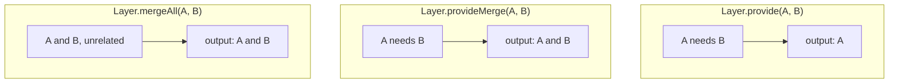

`Layer.provide` handles the vertical direction: this layer needs that one.
Nothing so far handles the horizontal one. The app now wants two repositories
over the same connection, neither of which needs the other, and putting them
side by side is a different operation with a different name.

## Two repositories

Both yield `Database` and neither provides it. That is deliberate, and it is
the decision the rest of this chapter and the next one turn on.

```ts twoslash
// src/repos.ts
import { Context, Effect, Layer } from 'effect'
interface Row {
  readonly id: string
  readonly title: string
}
class Database extends Context.Service<
  Database,
  { readonly query: (sql: string) => Effect.Effect<ReadonlyArray<Row>> }
>()('Database') {}
// ---cut---
export class UserRepo extends Context.Service<UserRepo>()('UserRepo', {
  make: Effect.gen(function* () {
    const database = yield* Database

    const findById = Effect.fn('UserRepo.findById')(function* (id: string) {
      return yield* database.query(`select * from users where id = '${id}'`)
    })

    return { findById }
  }),
}) {
  static readonly layer = Layer.effect(this, this.make)
}

export class ArticleRepo extends Context.Service<ArticleRepo>()('ArticleRepo', {
  make: Effect.gen(function* () {
    const database = yield* Database

    const listByAuthor = Effect.fn('ArticleRepo.listByAuthor')(function* (
      id: string,
    ) {
      return yield* database.query(`select * from articles where author = '${id}'`)
    })

    return { listByAuthor }
  }),
}) {
  static readonly layer = Layer.effect(this, this.make)
}
```

Each `static layer` has `Database` in its third slot, unprovided. The previous
chapter said a finished layer should have `never` there, and this is the
exception it mentioned: `Database` is the shared resource, and the whole point
of the next chapter is that these two must end up with the same one.

## Putting them next to each other

`Layer.mergeAll` takes any number of layers and produces one that provides all
of them.

```ts twoslash
import { Context, Effect, Layer } from 'effect'
interface Row { readonly id: string }
class Database extends Context.Service<
  Database,
  { readonly query: (sql: string) => Effect.Effect<ReadonlyArray<Row>> }
>()('Database') {}
class UserRepo extends Context.Service<
  UserRepo,
  { readonly findById: (id: string) => Effect.Effect<ReadonlyArray<Row>> }
>()('UserRepo') {
  static readonly layer: Layer.Layer<UserRepo, never, Database> = Layer.effect(
    this,
    Effect.gen(function* () {
      const database = yield* Database
      return { findById: (id: string) => database.query(id) }
    }),
  )
}
class ArticleRepo extends Context.Service<
  ArticleRepo,
  { readonly listByAuthor: (id: string) => Effect.Effect<ReadonlyArray<Row>> }
>()('ArticleRepo') {
  static readonly layer: Layer.Layer<ArticleRepo, never, Database> =
    Layer.effect(
      this,
      Effect.gen(function* () {
        const database = yield* Database
        return { listByAuthor: (id: string) => database.query(id) }
      }),
    )
}
// ---cut---
const repos = Layer.mergeAll(UserRepo.layer, ArticleRepo.layer)
//    ^?
```

Both services in the first slot, joined by a union. `Database` in the third,
still owed, now owed once for the pair. Merging combines outputs and combines
requirements, and it never satisfies anything.

The layers are built concurrently, which is free here and is worth knowing when
two of them each take a second to open a connection.

`Layer.merge` is the same operation for exactly two, written in pipe style:
`UserRepo.layer.pipe(Layer.merge(ArticleRepo.layer))`. Use `mergeAll` for a
list and `merge` when you are already in the middle of a pipe. There is no
other difference.

## Three ways to combine, and which one you want



The question that picks one is not "how do I combine these", it is "does one of
these build the other, and does anyone else need to see it".

`Layer.provide` when one builds the other and nobody else should see it. The
dependency becomes private. This is the default inside a service's own layer.

`Layer.provideMerge` when one builds the other and callers want both. The
output keeps the dependency, so downstream code can yield it directly.

`Layer.mergeAll` when they are unrelated. No feeding happens, so requirements
are combined rather than satisfied.

## Feeding the pair

Now give the two repositories a database. Providing satisfies the requirement
and hides it:

```ts twoslash
import { Context, Effect, Layer } from 'effect'
interface Row { readonly id: string }
class Database extends Context.Service<
  Database,
  { readonly query: (sql: string) => Effect.Effect<ReadonlyArray<Row>> }
>()('Database') {
  static readonly layer: Layer.Layer<Database> = Layer.succeed(this, {
    query: () => Effect.succeed([]),
  })
}
class UserRepo extends Context.Service<
  UserRepo,
  { readonly findById: (id: string) => Effect.Effect<ReadonlyArray<Row>> }
>()('UserRepo') {
  static readonly layer: Layer.Layer<UserRepo, never, Database> = Layer.effect(
    this,
    Effect.gen(function* () {
      const database = yield* Database
      return { findById: (id: string) => database.query(id) }
    }),
  )
}
class ArticleRepo extends Context.Service<
  ArticleRepo,
  { readonly listByAuthor: (id: string) => Effect.Effect<ReadonlyArray<Row>> }
>()('ArticleRepo') {
  static readonly layer: Layer.Layer<ArticleRepo, never, Database> =
    Layer.effect(
      this,
      Effect.gen(function* () {
        const database = yield* Database
        return { listByAuthor: (id: string) => database.query(id) }
      }),
    )
}
const repos = Layer.mergeAll(UserRepo.layer, ArticleRepo.layer)
// ---cut---
const reposOnly = repos.pipe(Layer.provide(Database.layer))
//    ^?

const reposAndDatabase = repos.pipe(Layer.provideMerge(Database.layer))
//    ^?
```

Same wiring, same connection, one difference in the output. After
`Layer.provide` the database is gone from the type and nothing downstream can
reach it. After `Layer.provideMerge` it is still there, and a handler that
wants to run a one-off query can yield `Database` without anyone re-providing
it.

Pick `provide` by default. A dependency nobody can see is a dependency nobody
can couple to, and the day you replace the database with something else, the
only file that knows is the one that provided it. Reach for `provideMerge` when
the thing genuinely is part of the public surface of that group, which for a
database client it sometimes is and for a config service it almost always is.

`provideMerge` is also the comfortable way to build a root graph in stages,
because each step keeps everything the previous steps produced:

```ts twoslash
import { Context, Effect, Layer } from 'effect'
class AppConfig extends Context.Service<
  AppConfig,
  { readonly databaseUrl: string }
>()('AppConfig') {}
class Tracing extends Context.Service<
  Tracing,
  { readonly span: (name: string) => Effect.Effect<void> }
>()('Tracing') {}
class Database extends Context.Service<
  Database,
  { readonly query: (sql: string) => Effect.Effect<ReadonlyArray<string>> }
>()('Database') {}
declare const DatabaseLive: Layer.Layer<Database, never, AppConfig | Tracing>
declare const ConfigLive: Layer.Layer<AppConfig>
declare const TracingLive: Layer.Layer<Tracing>
// ---cut---
const InfrastructureLive: Layer.Layer<Database | AppConfig | Tracing> =
  DatabaseLive.pipe(
    Layer.provideMerge(ConfigLive),
    Layer.provideMerge(TracingLive),
  )
```

Written with `Layer.provide` instead, each step would throw away the previous
step's output and you would end up with only the database.

## What people get wrong

Using `merge` where `provide` was meant, and reading the green compile as
success.

```ts twoslash
import { Context, Effect, Layer } from 'effect'
interface Row { readonly id: string }
class Database extends Context.Service<
  Database,
  { readonly query: (sql: string) => Effect.Effect<ReadonlyArray<Row>> }
>()('Database') {
  static readonly layer: Layer.Layer<Database> = Layer.succeed(this, {
    query: () => Effect.succeed([]),
  })
}
class UserRepo extends Context.Service<
  UserRepo,
  { readonly findById: (id: string) => Effect.Effect<ReadonlyArray<Row>> }
>()('UserRepo') {
  static readonly layer: Layer.Layer<UserRepo, never, Database> = Layer.effect(
    this,
    Effect.gen(function* () {
      const database = yield* Database
      return { findById: (id: string) => database.query(id) }
    }),
  )
}
// ---cut---
const notWired = Layer.mergeAll(UserRepo.layer, Database.layer)
//    ^?
```

`Database` is in the output, so it looks wired, and it is still in the input,
which is the part people skim past. `mergeAll` put the two layers next to each
other and never connected them. You find out at the app root, where the
requirement you thought was gone is still there and the error names a service
you are certain you provided.

The check is mechanical. After a combination that was supposed to satisfy
something, the third slot should have lost it. If the same service is in both
the first and third slot, nothing was fed to anything.

## Next

Both repositories owe a `Database`, and the layer that provides it is written
once. So does the connection get opened once, or twice? [One instance, or
two](/learn/layers/05-one-instance) answers it by running the thing.
