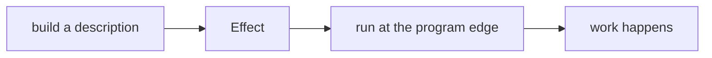

Calling an ordinary async function starts it. That feels so normal that it is
easy to miss the decision being made for you: creating the value and starting
the work happen at the same time.

Effect separates those two events. First you describe the work. Later, at the
edge of the program, you decide to run it.

That separation is the first mental shift. Most of the library follows from it.

## Before reading on

What is the value of `started` after the last line?

```ts twoslash
let started = 0

async function calculate(): Promise<number> {
  started += 1
  await Promise.resolve()
  return 42
}

const pending = calculate()
started
// ^?
```

The answer is `1`. Calling `calculate()` ran its body up to the first `await`.
The Promise in `pending` represents work already in progress.

This matters even if nobody awaits `pending`. A network request may have left
the machine. A file may be open. A counter may have changed. Holding the
Promise is already too late to decide whether the work should start.

## A Promise is a running computation

A Promise tells you that a result will arrive later. It does not retain a
reusable description of how to produce that result.

That is why operations such as retry need extra care. Retrying the same Promise
does not repeat the request. The Promise is one particular run. To try again,
you need a function that can create and start another one.

```ts twoslash
interface User {
  readonly id: string
}

declare const fetchUser: (id: string) => Promise<User>

const oneRun = fetchUser('u-1')
```

`oneRun` can settle only once. The instructions that created it are no longer
available as a value you can combine with other instructions.

Promises are useful at JavaScript boundaries. Browsers, Node.js, and many
libraries return them. The point is not that Promises are broken. The point is
that they have already chosen when execution begins.

## An Effect is a description

Building an Effect does not run its body.

```ts twoslash
import { Effect } from 'effect'

let started = 0

const calculation = Effect.sync(() => {
  started += 1
  return 42
})

started
// ^?
```

Here `started` is still `0`. `calculation` is a value describing a computation.
It says enough for the Effect runtime to perform that computation later, but it
has not performed anything yet.

The distinction is small on the page:



It changes what a library can do. Because the description still exists, Effect
can transform it before it runs. It can add a timeout, repeat it after a
failure, run it alongside another description, or replace a dependency for a
test. These operations build a new description. They do not secretly start the
old one.

## Running is a separate decision

A run function hands the description to the runtime.

```ts twoslash
import { Effect } from 'effect'

let started = 0
const calculation = Effect.sync(() => {
  started += 1
  return 42
})

const answer = Effect.runSync(calculation)
//    ^?
```

Now `started` is `1`, and `answer` is `42`.

Do not memorize `runSync` yet. Basic Effect covers run functions and when to
use each one. Keep the boundary in mind instead:

- most of the program builds and combines descriptions;
- one place near the entry point supplies what they need and runs them.

Calling a run function in the middle of the program collapses that boundary.
You get a result back, but Effect can no longer see or transform the work on the
other side of the call.

## What to carry forward

An Effect is not the successful value and it is not work in progress. It is a
value that describes work which may later produce a success, fail, or require
something from its environment.

For now, test your understanding with one question whenever you see an Effect:
"Has this run yet?" Unless it has reached a run function at the edge, the answer
is no.

Next, [Failure is a Value](/learn/mental-model/02-failure-is-a-value) applies
the same idea to errors. Instead of throwing failure out of the program's type,
Effect keeps it in the description.
