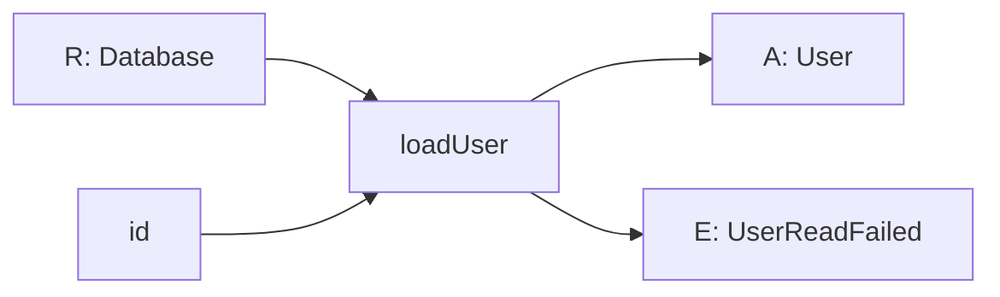

A function can have a simple signature and still depend on a database, the
clock, environment variables, or a global HTTP client. Those requirements live
in its body, usually behind imports.

The function works, but its type tells only half the story. You learn what goes
in and what comes out. You do not learn what must exist for the function to do
its job.

Effect records those requirements in the `R` channel.

## Before reading on

Assume this declaration came from a module you have not opened:

```ts twoslash
interface User {
  readonly id: string
  readonly name: string
}

declare const loadUser: (id: string) => Promise<User>
```

Could you call it in a unit test without a database? Does it read the current
time? Will it send an HTTP request? Does it depend on a module-level cache?

The signature cannot answer. An `id` goes in and a Promise of `User` comes out.
Everything needed in between is hidden.

Reading the body may reveal the dependencies, but every caller should not need
to inspect an implementation to understand its contract.

## Imports choose dependencies early

Imports are not the problem by themselves. Importing types, constants, and
pure helpers is ordinary module design.

The trouble starts when an import selects a stateful dependency for the whole
module. If `loadUser` imports one database client directly, then production and
tests both get that client unless the test runner intercepts the module.

That leads to familiar machinery: module mocks, patched globals, reset hooks,
and rules about import order. The tests are working around a decision that the
function's type never admitted existed.

Passing every dependency as a normal argument makes the requirement visible,
but it also threads infrastructure through functions that do not use it.
Dependency containers hide the threading, though they often move the contract
into runtime configuration.

Effect takes a different route. Requirements remain in the program's type while
Effect supplies their values separately.

## The R channel is what the program needs

Read the three channels as a sentence:

```text
Effect<A, E, R>
```

The program may succeed with `A`, may fail with `E`, and needs `R` before it can
run.

A database requirement can appear like this:

```ts twoslash
import { Context, Effect } from 'effect'

interface User {
  readonly id: string
  readonly name: string
}

declare class UserReadFailed {
  readonly _tag: 'UserReadFailed'
}

class Database extends Context.Service<
  Database,
  {
    readonly readUser: (
      id: string,
    ) => Effect.Effect<User, UserReadFailed>
  }
>()('app/Database') {}

declare const loadUser: (
  id: string,
) => Effect.Effect<User, UserReadFailed, Database>
```

Ignore how `Database` is declared for now. The last line is the useful part.
`loadUser` cannot run with an ID alone. Somebody must also provide a `Database`.
That fact is visible without opening the function.



Requirements combine as programs combine. If a later step needs a clock, the
larger program's `R` contains both `Database` and `Clock`. You do not maintain
that list by hand. The type follows what the program uses.

## Providing is an edge decision

Describing a requirement and choosing its implementation are separate jobs.
The inner program says, "I cannot load a user without a database." Code near
the application entry point decides which database implementation to provide.

A test can provide an in-memory implementation. Production can provide one
backed by a real server. The program between them does not change, and neither
does its success or failure contract.

This gives a test a clean question to answer: "What should this dependency do
for this case?" It no longer has to replace a module that was selected before
the test started.

When every requirement has been supplied, `R` becomes `never`. In this position,
`never` means the program needs nothing else from its environment. It is ready
to reach a run function.

Basic Effect teaches services, layers, and the APIs used to provide them. The
mental model comes first: a dependency is part of what a program is. Hiding it
in a body does not make it disappear.

## What to carry forward

Before reading an Effect implementation, read `R`. It answers, in types, the
question ordinary code often leaves to setup notes: "What must exist before
this can work?"

Then ask whether each requirement is real. A database, clock, or HTTP client has
behavior worth replacing. A pure formatting function usually does not. Putting
every helper into `R` creates ceremony without buying a useful choice.

Next, [Unlearning try, catch and await](/learn/mental-model/04-unlearning-the-keywords)
puts descriptions, failures, and requirements into one boundary map.
