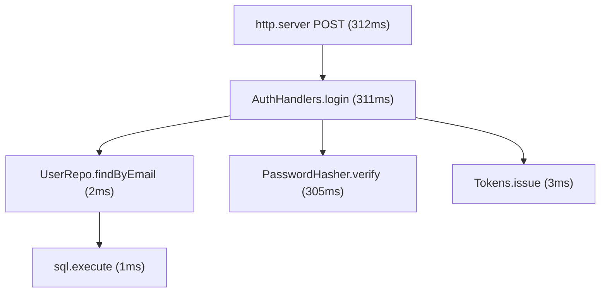
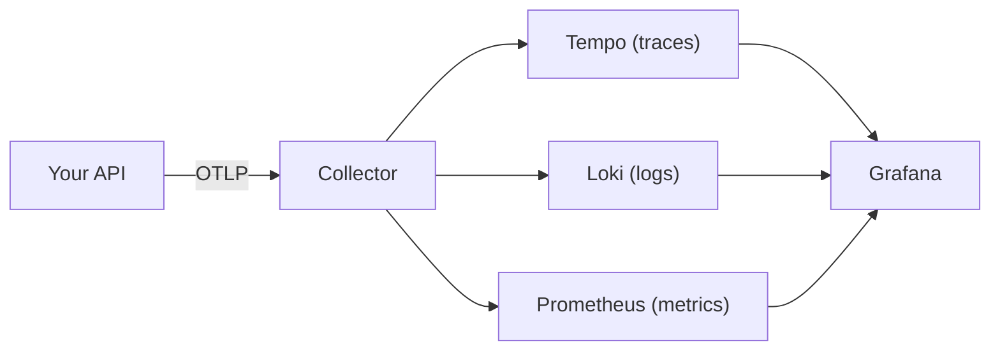

`POST /login` takes 300 milliseconds and you want to know why. The console
gives you one line:

```
[10:21:44.062] INFO (#31) http.span=312ms: Sent HTTP response {
  "http.method": "POST",
  "http.url": "/login",
  "http.status": 200,
}
```

One number, for the whole request. Did the time go to the database, the password
hash, or the token? The line cannot say, because it was written after all three
had finished.

Observability is the habit of recording enough, while the code runs, that you
can answer that afterwards. It comes in three kinds of record. This chapter
defines each one, easiest first, and then shows how they get from your process
to somewhere you can read them.

## A log record

You have met this one. A **log record** is a single event: a time, a severity
such as `INFO` or `ERROR`, a message, and some named fields. The line above is
one, written by `Effect.log`.

Logs are good at saying what happened. They are bad at saying which request it
happened to. Fifty logins arriving together write fifty interleaved
`Sent HTTP response` lines, and nothing links a line to the request that wrote
it.

## A span

A **span** is one timed step of work. It has a name, a start time, a duration,
and a status of `ok` or `error`. It can also carry **attributes**, which are
named values you attach, such as a user id.

Spans nest. The login handler is a step, and inside it the database lookup is
another step, so the lookup is a **child** of the handler. Each span records
which span it sits inside, called its **parent**.

## A trace

A **trace** is every span that belongs to one request. They all share one
**trace id**, a random 32 character string, and each span also has its own
**span id**. The parent links turn the spans into a tree.



A viewer draws that tree as a **waterfall**: one bar per span, laid out in time.
The 300 milliseconds goes to `PasswordHasher.verify`. That is the answer the log
line could not give, and it is why spans come first in this track.

## A metric

A **metric** is a number measured over time, with no request attached. How many
logins per second. How many of them failed. How long the slowest 5 percent took.

A trace explains one request, and a metric describes all of them. A trace will
not tell you that failures tripled at noon, and a metric will not tell you why.
You want both, and you move from one to the other.

## How they travel

Your process only produces these records. Something else has to store and show
them. The code in your process that sends records out is called an
**exporter**.

The exporters in this track speak **OTLP**, the OpenTelemetry protocol. It is
plain HTTP: the exporter `POST`s a batch of JSON to `/v1/traces`, `/v1/logs` or
`/v1/metrics`. Because it is an open format, any program that understands it
can receive the data.

The receiver is a **collector**: a small program whose job is to accept OTLP,
process it, and forward it onward. Here the collector forwards traces to Tempo,
logs to Loki, and metrics to Prometheus. Those three are **backends**, the
programs that store each kind of record, and Grafana reads from all of them.



Why a collector, instead of the API talking to each backend? Your process then
speaks one protocol to one address, and every decision about where data goes
lives in a config file you can change without touching the code. The collector
also does something no backend does, which
[metrics from spans](/learn/observability/07-metrics-from-spans) uses: it turns
spans into metrics on the way through.

## What Effect records with nothing installed

Effect does not wait for an exporter. `Effect.fn` with a name makes a span every
time the function runs, and `Effect.log` writes a log record. With no exporter,
the spans are built in memory and nobody reads them, and the logs go to the
console. You can see this, because a running span can be asked about itself with
`Effect.currentSpan`.

Save this as `observability/spans.ts`:

```ts twoslash
// observability/spans.ts
import { Effect } from 'effect'

const findUser = Effect.fn('UserRepo.findByEmail')(function* (email: string) {
  yield* Effect.log('looking up a user')
  const span = yield* Effect.currentSpan
  return { name: span.name, traceId: span.traceId, spanId: span.spanId }
})

const login = Effect.fn('AuthHandlers.login')(function* (email: string) {
  const span = yield* Effect.currentSpan
  //    ^?
  yield* Effect.annotateCurrentSpan('attempt', 1)
  const child = yield* findUser(email)
  return {
    outer: {
      name: span.name,
      traceId: span.traceId,
      spanId: span.spanId,
      attributes: Object.fromEntries(span.attributes),
    },
    child,
  }
})

Effect.runPromise(login('ada@example.com')).then(console.log)
```

Run it with `bun observability/spans.ts`. The ids differ on every run, and the
shape does not:

```
[16:48:34.318] INFO (#1): looking up a user
{
  outer: {
    name: "AuthHandlers.login",
    traceId: "1ec13c1e8ca2f2077e5ed449ed0e2d07",
    spanId: "9990eaa9c4b8f1a1",
    attributes: {
      attempt: 1,
    },
  },
  child: {
    name: "UserRepo.findByEmail",
    traceId: "1ec13c1e8ca2f2077e5ed449ed0e2d07",
    spanId: "919c17e91e981876",
  },
}
```

Two spans, one trace id, two span ids, and the attribute sits on the span it was
added to. The log line is the console version of a log record. It has no trace
id on screen, but it will once an exporter is attached, because the exporter
reads the running span when it writes the record. That is the link
[when login fails](/learn/observability/06-when-login-fails) follows.

`Effect.annotateCurrentSpan` adds an attribute to whichever span is running.
Called inside `login`, it lands on `AuthHandlers.login` and not on the child.

## What people get wrong

Treating this as setup work that needs the whole stack first. The spans and the
logs already exist in your code, and the stack only decides where they go. That
is why the next two chapters can build the stack without changing a line of the
API.

It is also why a function with no name gets no span. `Effect.fn` with only a
body, as in the last track's `bearer` middleware, is a plain function to the
tracer. A span needs a name to be worth looking up later, and
[filling the trace](/learn/observability/05-filling-the-trace) goes back and
names the ones the API left out.

## Next

The words are settled. [The stack's configs](/learn/observability/02-the-stacks-configs)
writes the files for the five programs that store and show the records, and
explains why each port sits where it does.
